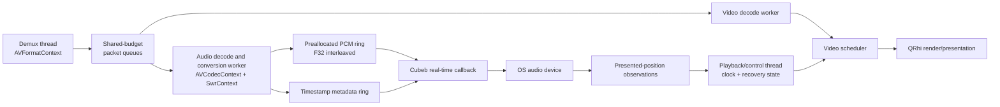

# Sunroom audio architecture research

## Recommendation

Use **current upstream cubeb** as Sunroom’s production audio-device backend, pinned to an exact reviewed commit through a **project-local vcpkg overlay port**.

Use **FFmpeg libswresample** to normalize decoded audio into **native-endian interleaved float32 PCM** before it reaches the real-time boundary.

Keep only one narrow sink contract, with two implementations:

* `ControlledAudioSink` for deterministic synchronization tests.
* `CubebAudioSink` for real devices.

Do not add a general backend/plugin framework yet.

This is not “adding cubeb because it is convenient.” It is justified by one requirement that Qt does not currently satisfy cleanly: Sunroom wants the audio clock to represent the media position **actually reaching the listener**, including backend buffering and device latency. Cubeb exposes a playback-position API, approximate output latency, device-change notifications, default-device following, preroll, and explicit real-time callback rules as part of one cross-platform contract.

One correction to my earlier interim conclusion: cubeb is not literally the only cross-platform library with useful timing primitives. PortAudio exposes callback DAC timestamps and output latency. It still loses overall because portable hotplug/default-device migration remains unfinished rather than part of its established API. ([PortAudio][1])

## Why not simply use Qt?

Qt 6.11.1’s `QAudioSink` callback API is a legitimate production audio-output API. It already provides Windows, macOS, and Linux backends, device enumeration, default-device change notifications, formats, volume, and a soft real-time callback. Qt explicitly warns that the callback must not allocate, block, lock, or perform other non-real-time work. ([Qt Documentation][2])

The problem is timing. Qt documents `processedUSecs()` as the amount of audio processed since the stream started—not as the sample position currently audible at the output. Its implementation counts frames as they are consumed from Qt’s application-side ring buffer, before the operating-system and hardware queues have necessarily presented them. The Windows backend itself has WASAPI access, but Qt does not expose a public `IAudioClock`-equivalent observation.

That leaves three Qt designs:

1. Use `processedUSecs()` as the master clock and accept a device-dependent A/V offset.
2. Subtract an estimated latency and maintain calibration heuristics.
3. Add native WASAPI/CoreAudio/PipeWire timing extensions alongside Qt.

The third option eventually becomes a second audio abstraction hidden underneath Qt. At that point Qt is no longer the simpler architecture.

Qt is therefore a credible fallback if cubeb fails its build or device-recovery acceptance tests. It should not be the preferred backend for the stated clock requirements.

## Candidate comparison

| Option              | Presentation timing                                               | Devices and recovery                                                      | Cross-platform backend status                  | Integration cost                                         | Verdict                             |
| ------------------- | ----------------------------------------------------------------- | ------------------------------------------------------------------------- | ---------------------------------------------- | -------------------------------------------------------- | ----------------------------------- |
| **cubeb**           | Playback position plus approximate callback-to-audibility latency | Enumeration, default following, collection changes, stream device changes | Tier-1 WASAPI, Rust AudioUnit, Rust PulseAudio | Moderate: overlay port and Rust packaging on macOS/Linux | **Choose**                          |
| **Qt QAudioSink**   | Processed/submitted duration, not promised audible position       | Good enumeration and change signals; application recreates/reanchors      | Strong, already in Sunroom                     | Lowest dependency cost                                   | Fallback                            |
| **PortAudio**       | Strong callback DAC time and output-latency primitives            | Portable hotplug/default migration is unfinished                          | Mature WASAPI/CoreAudio/ALSA/etc.              | Moderate                                                 | Reject for device-recovery boundary |
| **miniaudio**       | No portable presented-position API found                          | Broad enumeration and automatic rerouting support                         | WASAPI/CoreAudio/Pulse/ALSA/JACK               | Extremely easy                                           | Reject for clock boundary           |
| **SDL3**            | No portable presented-position API found                          | Good logical-device migration on unplug/default change                    | Broad and mature                               | Adds a large unrelated subsystem                         | Reject                              |
| **Native backends** | Best possible access                                              | Complete control, entirely application-owned                              | WASAPI/CoreAudio/PipeWire or Pulse             | Three implementations and test matrices                  | Escape hatch only                   |

### cubeb

Cubeb’s upstream project explicitly presents latency-compensated A/V clock reporting as a feature. Its current Tier-1 desktop backends are WASAPI on Windows, Rust AudioUnit on macOS, and Rust PulseAudio on Linux. It was created for Firefox’s real-time media needs and remains actively maintained; the examined upstream revision contains a July 24, 2026 WASAPI device-invalidation recovery fix.

Its public API provides:

* Output position in frames.
* Approximate callback-to-listener latency in frames.
* Preferred sample rate and minimum supported latency.
* Default-device following when no explicit device is supplied.
* A permanently selected device when an explicit device is supplied.
* Device enumeration and device/default-change callbacks.
* Interleaved S16 or float32 PCM with explicit layouts, up to eight channels.
* Software stream volume where supported.
* A callback contract that prohibits blocking and treats a short callback return as final draining.

On WASAPI, the current position implementation calculates a logical playback head from the total stream frames written minus the current downstream delay, then prevents that position from moving backwards. Its latency implementation uses `IAudioClient::GetStreamLatency`, with a fallback for Windows configurations returning zero. That makes cubeb position the primary clock observation; Sunroom must **not subtract cubeb latency again** from that position. Latency remains useful as a diagnostic and fallback input.

Cubeb follows Windows default-endpoint changes and handles session disconnection and endpoint invalidation internally. Sunroom should still treat those notifications as a clock discontinuity and own the higher-level freeze, preroll, re-anchor, and resume policy.

Cubeb does not expose a normal cross-platform exclusive-mode contract. Its Windows `RAW` preference bypasses optional signal processing but does not mean exclusive access. That is desirable here: shared mode integrates with system volume, Bluetooth, notifications, and default-device migration. Exclusive output and encoded passthrough should wait.

#### Packaging caveat

The stock vcpkg cubeb port is dated September 26, 2023 and pins an old source snapshot. Its portfile does not enable the current Rust backends. Using that port unchanged would undermine the reason for selecting cubeb.

Sunroom should maintain a small overlay port which:

* Pins a reviewed cubeb commit.
* Pins the CoreAudio and PulseAudio Rust submodule revisions.
* Builds statically.
* Disables cubeb tests and tools for production.
* Enables Rust backends on macOS and Linux.
* Builds macOS with `NO_PRIVATE_APIS_IN_COREAUDIO=ON`.
* Uses a pinned Rust toolchain and vendored or otherwise locked Cargo dependencies.
* Runs Windows MSVC and clang-cl builds in CI.

Cubeb upstream supports MSVC and Clang generally, but I did not find an explicit guarantee for the exact clang-cl/vcpkg combination. Treat clang-cl as an acceptance test, not a verified fact. The current Tier-1 macOS and PulseAudio implementations are separate Rust submodules producing static libraries.

### Qt Multimedia

Qt is the dependency-minimal choice because Sunroom already ships it. The Windows implementation uses event-driven WASAPI and an audio worker thread. Linux currently prefers PipeWire, with PulseAudio fallback and experimental ALSA support. Qt’s public API and maintenance guarantees are also much stronger than those of a small header-only library. ([Qt Documentation][3])

Its weaknesses for this project are:

* No portable presented-frame clock.
* No portable output-latency observation sufficient to derive one precisely.
* No public exclusive-mode control.
* Device replacement still requires application-level recovery and clock policy.
* Using private Qt backend APIs would be more fragile than using cubeb directly.

Qt supports volume but Sunroom should implement mute and gain in its own callback anyway so the controlled sink and real sink have identical semantics.

Licensing is the existing Qt Multimedia licensing model: commercial or LGPLv3/GPL options. Runtime deployment requires the Qt Multimedia module and its platform integration plugins. ([Qt Documentation][4])

### PortAudio

PortAudio has a more sophisticated timing contract than Qt, miniaudio, or SDL. `PaStreamCallbackTimeInfo::outputBufferDacTime` reports the time when the first sample in a callback buffer should reach the DAC, and `PaStreamInfo::outputLatency` supplies expected output latency in the same timing model. ([PortAudio][1])

However, PortAudio’s own hotplug documentation describes device notification and migration work on a separate hotplug branch. For Sunroom, device loss, Bluetooth reconnection, and default-device changes are core requirements rather than optional polish. That outweighs the good callback timing. ([GitHub][5])

The current vcpkg port is PortAudio 19.7, MIT licensed, with optional ASIO support.

### miniaudio

Miniaudio has excellent deployment characteristics: one source implementation, permissive licensing, broad native backends, enumeration, conversion, callback output, and backend-specific exclusive support. Its WASAPI and CoreAudio implementations can reroute default streams automatically. The current vcpkg package is 0.11.25 under MIT-0 or Unlicense.

I found no public, portable API that gives Sunroom a latency-compensated presented sample position. Miniaudio’s clocks and node-graph time primarily represent engine processing, not a cross-platform promise of audibility. Its API is also still pre-1.0 and the project has documented planned structural changes for 0.12. ([Miniaudio][6])

It is an excellent choice for applications that merely need sound output. It is not the best fit for an audio-master video scheduler.

### SDL3

SDL3 provides a mature logical-device model and can migrate streams when the default device changes or a device disappears. It also exposes obtained formats, callback buffer sizes, and stream gain. ([SDL Wiki][7])

I found no portable presented-position or end-to-end output-latency clock. It would also introduce SDL’s wider platform subsystem into an application already using Qt. The current vcpkg port enables substantial Linux integration features by default.

### Narrow native backends

WASAPI can expose device position and a correlated QPC timestamp through `IAudioClock::GetPosition`; CoreAudio exposes device latency and safety offsets; PipeWire exposes stream time, delay, and monotonic timing observations. These are the strongest raw timing primitives. ([Microsoft Learn][8])

The cost is three backend implementations, three device-notification systems, format negotiation, session policy, real-time thread setup, Bluetooth behavior, and three recovery test matrices. Cubeb already packages most of that work behind a small C API. Native implementations should be retained as an escape route only if a cubeb backend proves insufficient on a particular platform.

## Proposed responsibility and thread model

### Ownership

| Component               | Owns                                                                                | Must not do                                                  |
| ----------------------- | ----------------------------------------------------------------------------------- | ------------------------------------------------------------ |
| Demux thread            | `AVFormatContext`, packet routing, shared queue budget                              | Wait permanently on one stream’s individual queue            |
| Audio worker            | Audio `AVCodecContext`, `SwrContext`, timestamp normalization, PCM production       | Touch the physical audio device                              |
| Cubeb callback          | Copy PCM, write zeros, apply gain, advance lock-free cursors                        | Decode, allocate, wait, log synchronously, invoke cubeb APIs |
| Playback/control thread | Sink lifecycle, play intent, recovery state, clock observations, generation changes | Run real-time callback work                                  |
| Video scheduler         | Select/drop/hold frames against media clock                                         | Modify the audio clock to hide video scheduling errors       |
| GUI thread              | Commands and immutable state snapshots                                              | Own decoding or device recovery                              |

The sink abstraction should expose only:

* Open with an output format and render callback.
* Start, stop, and reset.
* Current device identity and device-change/error events.
* Presented-frame observation with monotonic observation time.
* Optional reported latency and confidence.
* A monotonically increasing output epoch.

That is enough for cubeb and the controlled sink. There is no need for backend factories, plugins, graph nodes, or arbitrary audio processors.

## libswresample and the internal PCM contract

Sunroom should enable the `swresample` feature in its existing FFmpeg 8.1.2 vcpkg dependency. This is an additional FFmpeg component, not a separate third-party framework. The current vcpkg FFmpeg manifest exposes `swresample` directly.

### Recommended sink-facing representation

Use:

* Native-endian IEEE float32.
* Interleaved channels.
* One fixed sample rate and channel layout per audio-output epoch.
* Explicit media timestamp on every metadata segment.
* Absolute converted-PCM frame indices.
* Generation and discontinuity identifiers.

Float32 is appropriate because it gives straightforward mixing, gain, mute, clipping control, and channel remapping. Cubeb supports native-endian float32 directly, and its callback examples and channel-layout model are interleaved.

Planar PCM would make FFmpeg-side processing convenient but would add work in every device callback path. Decoders may output planar samples; `libswresample` should perform the one deliberate conversion off the real-time thread.

### Output rate

At real-device open:

1. Query cubeb’s preferred sample rate.
2. Negotiate the desired channel layout.
3. Construct the `SwrContext` for that output epoch.
4. Convert all decoded audio into that fixed sink format.
5. Recreate the converter and flush old PCM if the output device requires a new epoch or format.

For the deterministic milestone, use a fixed 48 kHz stereo sink. That gives reproducible fixture expectations without pretending all real devices use that format.

Cubeb may still perform host conversion if the device mix format differs, but selecting its preferred rate reduces avoidable double resampling. Cubeb explicitly provides the preferred-rate query for this purpose.

### Responsibility split

| Layer           | Responsibility                                                                                                                     |
| --------------- | ---------------------------------------------------------------------------------------------------------------------------------- |
| FFmpeg decoder  | Decode compressed audio and expose decoded timestamps/layout                                                                       |
| libswresample   | Sample format conversion, planar/interleaved conversion, channel rematrixing, sample-rate conversion, converter delay and flushing |
| Playback core   | Global timestamp normalization, gaps/discontinuities, generations, queueing, PCM-to-media mapping                                  |
| Audio backend   | Device negotiation, callback scheduling, device errors, presented-position observations                                            |
| Video scheduler | Compare video presentation timestamps with the resulting media clock                                                               |

`libswresample` exposes its buffered conversion delay and timestamp helpers, and can later perform gradual compensation through `swr_set_compensation`. That compensation should not be enabled initially merely because it exists. ([FFmpeg][9])

### Timestamp contract

Each converted PCM segment should carry:

| Field             | Meaning                                              |
| ----------------- | ---------------------------------------------------- |
| `generation`      | Open/seek/fallback recovery generation               |
| `audio_epoch`     | Specific sink/device clock epoch                     |
| `media_start`     | First sample’s normalized media timestamp            |
| `pcm_start_frame` | Absolute converted-stream frame index                |
| `frame_count`     | Number of interleaved PCM frames                     |
| `sample_rate`     | Frames per second for this epoch                     |
| `channel_layout`  | Semantic channel positions                           |
| `discontinuity`   | None, seek, timestamp jump, device replacement, etc. |

Normalize audio and video timestamps into one integer media-time domain, preferably nanoseconds or another sufficiently fine integer unit. Use each stream’s `time_base` and decoded `best_effort_timestamp` where appropriate. Do not independently zero audio and video streams: that would erase the inter-stream offset encoded by the container. ([FFmpeg][10])

Once a valid audio timestamp is established, advance subsequent output timestamps by exact produced sample counts:

[
t_{n+1}=t_n+\frac{N_\text{output frames}}{R_\text{output}}
]

A substantial mismatch between this expected timestamp and a later decoded timestamp should create an explicit discontinuity or gap—not a silent clock adjustment.

At end of stream, flush `SwrContext` fully before allowing the backend to drain.

## Audio presentation clock

The soundest model separates three concepts:

1. **PCM media position:** where a sample belongs in the movie.
2. **Backend stream position:** its sequential frame number in the current device epoch.
3. **Monotonic observation time:** when Sunroom observed the backend position.

Let:

* (W) be total frames supplied by the callback in the current epoch.
* (P) be cubeb’s reported presented position.
* (R) be the output sample rate.
* (t_o) be the monotonic midpoint of the position query.
* (t) be the current monotonic time.

For a fresh, confident, running observation:

[
\hat P(t)=\min\left(W,;P+R(t-t_o)\right)
]

Then look up (\hat P(t)) in the stream-frame-to-media mapping ledger.

Take a timestamp immediately before and after querying cubeb and use their midpoint for (t_o). This bounds query-call timing error. Sample position and latency must be queried from the control or scheduler thread, never from the cubeb data callback.

### Media/hold mapping ledger

Every submitted backend frame belongs to one of two categories:

* **Media:** its passage advances the movie timeline.
* **Hold:** the device plays silence while the movie timeline remains frozen.

Examples:

| Output                              | Mapping                          |
| ----------------------------------- | -------------------------------- |
| Normal decoded PCM                  | Media                            |
| Silence that exists in the source   | Media                            |
| Muted decoded PCM replaced by zeros | Media                            |
| Short underrun silence              | Hold                             |
| Device-recovery silence             | Hold                             |
| Preroll before intentional start    | Not yet visible as running media |

For a Media range, backend frame position maps linearly to media timestamp. For a Hold range, every backend frame maps to the same frozen media timestamp.

This distinction is important. Simply counting all samples returned by the callback would cause the movie to continue while an underrun or lost Bluetooth device emits silence. Conversely, stopping the clock for muted audio would be incorrect.

The ledger must be preallocated or use a bounded SPSC metadata ring. Adjacent segments of the same type should be coalesced. Metadata overflow should lower clock confidence and force a re-anchor rather than silently inventing a position.

### Latency

When `cubeb_stream_get_position()` succeeds, use it as the primary presentation observation. Do not calculate:

[
P_\text{cubeb}-L_\text{cubeb}
]

because the backend position may already compensate for its stream delay, as the WASAPI implementation does.

Use reported latency for:

* Diagnostics.
* Detecting suspicious changes.
* Estimating an initial render lead.
* A lower-confidence fallback if position is temporarily unavailable.

A fallback based on submitted frames minus approximate output latency is necessarily less trustworthy and should be marked as estimated.

### Pause and seek

Pause:

* Preserve the user’s play intent separately from backend state.
* Stop or suspend the sink.
* Freeze the media clock at the last confident presented position.
* On resume, create or validate a new observation anchor before advancing.

Seek:

* Increment playback generation.
* Stop/reset the sink.
* Cancel and flush packet, decoder, converter, PCM, and metadata queues.
* Reset `SwrContext`.
* Preroll the new generation.
* Start a new audio epoch and anchor its first presented frame to the seeked media timestamp.

No stale callback work may cross the generation boundary.

### Underrun

For a transient underrun:

* Return the full requested frame count to cubeb.
* Fill the missing portion with zeros.
* Do not consume media PCM for those frames.
* Record them as Hold.
* Lower clock confidence and increment diagnostics.

Returning fewer frames would tell cubeb that the stream has reached EOS and should drain, because that is cubeb’s documented callback contract.

For a sustained underrun:

* Enter `BufferingHold`.
* Stop the sink rather than accumulating arbitrary amounts of hold silence.
* Refill audio and video preroll.
* Start a new epoch and re-anchor.

### Device replacement

On default-device change, device loss, or Bluetooth reconnection:

1. Device callback posts a lock-free event; it does not perform recovery.
2. Control thread enters `Reconfiguring`.
3. Freeze the media timeline at the last confident presentation point.
4. Stop/destroy or reset the cubeb stream.
5. Resolve the new default or selected device.
6. Re-negotiate format and rebuild `SwrContext` if needed.
7. Start a new audio epoch.
8. Preroll and obtain a trustworthy position observation.
9. Resume only if `userPlayIntent == Playing`.

Cubeb may internally follow default devices, but Sunroom should not assume that backend position remains continuous across every platform’s reconfiguration. The first real-device experiments should determine whether retaining the stream or explicitly recreating it yields cleaner epoch semantics.

### Sources without audio

Use the existing monotonic media clock, but place it behind the same clock-snapshot interface. The scheduler should know whether a snapshot is:

* Audio presentation master.
* Monotonic no-audio master.
* Frozen.
* Estimated or low-confidence.
* Discontinuous and awaiting re-anchor.

## A/V synchronization state model

Suggested states:

| State                   | Clock behavior                                  |
| ----------------------- | ----------------------------------------------- |
| `Stopped`               | No active timeline                              |
| `Prerolling`            | Fixed at requested start/seek position          |
| `RunningAudioMaster`    | Derived from presented audio frames             |
| `RunningExternalMaster` | Monotonic clock for sources without audio       |
| `Paused`                | Frozen                                          |
| `BufferingHold`         | Frozen while queues refill                      |
| `Reconfiguring`         | Frozen while device/stream epoch changes        |
| `Draining`              | Audio presentation continues until final sample |
| `Ended`                 | Fixed at final presented media position         |

Keep user intent orthogonal:

* `WantsPlaying`
* `WantsPaused`

This prevents a device interruption from accidentally resuming playback after the user pressed pause during recovery.

## Video scheduling policy

For each decoded video frame, derive the interval for which it is valid:

[
[\text{PTS}*i,\text{PTS}*{i+1})
]

For variable-frame-rate content, use the next valid frame timestamp rather than an assumed nominal frame rate. Use a conservative fallback duration only when timestamps are missing.

At the predicted display presentation time:

* **Frame early:** wait until its media interval is due, accounting for estimated render/presentation lead.
* **Slightly late:** present immediately.
* **Frame fully superseded:** drop it and examine the next frame.
* **Far behind after a stall:** skip directly to the newest frame appropriate for current audio time; do not attempt a prolonged fast catch-up.
* **Audio clock discontinuity:** clear pending scheduling assumptions and re-anchor explicitly.

The initial policy should be:

* Audio presentation drives video.
* Video waits or drops.
* No continuous audio resampling.
* No routine frame duplication.
* No aggressive “drop whenever late” threshold.
* Explicit discontinuity recovery rather than hiding jumps through smoothing.

A useful frame-selection rule is to choose the newest frame whose PTS is not later than the predicted audio media time, unless that frame has already been superseded by the next frame’s PTS.

### Bluetooth devices

A high-latency Bluetooth device should not require a special scheduler mode. Its latency should appear through the audio presentation observation. A change between Bluetooth profiles, reconnection, or a sudden latency discontinuity should create a new audio epoch rather than gradually bending the clock toward the new offset.

### Gradual drift correction

For ordinary local-file playback, audio and video share one source timeline and video follows the physical audio clock. Continuous audio-rate correction is therefore normally unnecessary.

Small `swr_set_compensation` adjustments should be considered only after measurements show persistent drift against an independent master, such as:

* A live stream with a separate reference clock.
* Long-duration hardware clock mismatch that cannot be handled through video cadence.
* A platform backend whose reported clock exhibits stable rate error.

Any later correction should be bounded, filtered, and hysteretic. Do not feed instantaneous video lateness directly into audio resampling. That creates a feedback loop in which audio correction changes the master clock while video simultaneously reacts to it.

## Presentation-backend observations

The audio sink should provide:

* Audio epoch and generation.
* Submitted stream-frame count.
* Presented stream-frame position.
* Monotonic observation timestamp.
* Reported latency.
* Position/latency confidence.
* Device identity and revision.
* Callback period and jitter statistics.
* Underrun and hold-frame counts.

The QRhi/presentation side should provide where available:

* Frame media PTS.
* CPU render-submission time.
* Swapchain submission time.
* Predicted presentation time.
* Actual presentation feedback or sequence number.
* Current refresh interval.
* Estimated queue depth.
* Whether presentation timing is observed, estimated, or unavailable.

QRhi cannot be assumed to expose precise cross-platform scan-out timing. The initial player can use an estimated render lead and audio-based frame selection, but only physical measurement can establish the final photon-to-sound relationship.

## Bounded demux-to-callback pipeline

### Packet routing

Do not enforce independent hard packet-queue caps which cause the demux thread to block on one stream.

Consider an interleaved file where the video queue reaches its hard cap. If the demux thread blocks before reading later audio packets, the audio decoder empties its queue, the callback underruns, and playback cannot recover even though total memory remains bounded.

Use:

* One shared encoded-packet byte budget.
* Per-stream duration and byte **soft** watermarks.
* A single global hard cap.
* Wake-up when any decoder releases budget.
* Duration limits in addition to byte limits.
* Immediate discard of unselected-stream packets.

This allows the demux thread to absorb normal interleave bursts. No finite bounded queue can guarantee reaching audio through an arbitrarily pathological container interleave, so the hard cap remains an explicit robustness tradeoff rather than a mathematical guarantee.

### Audio decode and conversion

The audio worker:

1. Takes current-generation encoded packets.
2. Decodes all available frames.
3. Normalizes timestamps.
4. Converts through `SwrContext`.
5. Waits cancellably when the PCM ring reaches its high watermark.
6. Writes PCM and matching metadata atomically enough that the callback never sees unlabelled samples.
7. Flushes decoder and resampler at EOS.

### PCM callback boundary

Use a preallocated SPSC PCM ring and a parallel metadata ring.

The callback performs only:

* Atomic generation/epoch load.
* Bounded ring reads.
* Gain or mute application.
* Zero fill.
* Cursor updates.
* Fixed-capacity metadata emission.

No `AVFrame`, `AVPacket`, `std::vector` growth, shared-pointer destruction, mutex, condition variable, Qt signal delivery, or synchronous logger belongs there.

### Preroll

Start real playback only when:

* Audio has a minimum PCM horizon.
* Video has a frame at or around the target timestamp.
* Current generation is still valid.
* The sink is open.
* The user still intends playback.

Cubeb itself invokes the callback to preroll before stream start, so the ring must already contain data before calling `cubeb_stream_start()`.

Initial experimental—not contractual—queue values:

* PCM: 250–500 ms.
* Start preroll: approximately 100–250 ms.
* Shared encoded-packet budget: 8–16 MiB.
* Packet time horizon: approximately 2–4 seconds per selected stream as a soft target.

These should be tuned from callback jitter, network behavior, seek latency, and Bluetooth testing rather than enshrined as architecture.

## Smallest useful implementation sequence

### Stage 0: Dependency acceptance gate

Before integrating playback:

* Build a pinned current cubeb overlay.
* Build static Windows x64 with MSVC.
* Build the same overlay with clang-cl.
* Run cubeb’s small playback/enumeration tests.
* Verify default and explicit device opening.
* Confirm no unexpected DLLs are introduced.
* Establish the macOS and Linux Rust build process in CI, even if those platforms are not yet wired into Sunroom.
* Record licenses and Cargo transitive dependencies.

Failure here should reopen Qt-plus-native-timing as the fallback. It should not silently fall back to the stale 2023 vcpkg package.

### Stage 1: Controlled-sink vertical slice

Use a real, checked-in FFmpeg A/V fixture containing:

* Precisely timestamped audio impulses.
* Corresponding visual flashes.
* Non-zero container start time.
* Variable video frame durations.
* At least one seek target.
* A deterministic final audio drain.

Run real:

* `avformat` demux.
* Audio and video decode.
* libswresample conversion.
* Bounded queues.
* Audio mapping ledger.
* Video frame scheduling.

The controlled sink should simulate:

* Configurable callback quantum.
* Configurable output latency.
* Virtual presented position.
* Callback jitter.
* Short and sustained underruns.
* Pause and resume.
* Device replacement.
* Position discontinuity.
* Delayed Bluetooth-like output.
* End-of-stream draining.

Behavioral assertions should cover:

* Audio clock equals the expected impulse timeline.
* Mute advances the clock.
* Hold silence does not advance media time.
* Video flash selection follows presented audio, not submitted audio.
* Seek invalidates every stale packet/frame/sample.
* Pause freezes both clock and frame selection.
* Device recovery resumes only with play intent.
* EOS is not confused with an underrun.
* No-audio sources use the monotonic fallback.

### Stage 2: Windows cubeb backend

Add real WASAPI-through-cubeb testing:

* Shared-mode default device.
* Explicit device.
* Default-device switch.
* USB unplug/replug.
* Bluetooth disconnect/reconnect.
* Bluetooth profile or sample-rate change.
* Sleep/wake.
* Audio service interruption if practical.
* Reported position monotonicity.
* Position behavior across reconfiguration.
* Latency changes and callback jitter.
* Long-duration drift against the controlled expected timeline.

This stage determines whether cubeb’s automatic default-device reconfiguration can remain inside one stream or whether Sunroom should recreate the stream for every device epoch.

### Stage 3: macOS and Linux

macOS:

* Rust AudioUnit backend.
* Private APIs disabled.
* Device switching and aggregate-device behavior.
* Bluetooth and AirPods reconnection.
* Signing and notarization with the static Rust backend.

Linux:

* Rust PulseAudio backend.
* Native PulseAudio server.
* PipeWire’s PulseAudio-compatible server.
* Default sink changes.
* Bluetooth profile changes.
* Server restart and reconnect.
* Packaged client-library behavior on target distributions.

PipeWire deliberately provides a PulseAudio-compatible server, so a Pulse backend is not automatically obsolete on a PipeWire desktop. ([PipeWire][11])

### Stage 4: Measurement-led refinements

Only after data exists:

* Tune queue sizes.
* Tune video lateness tolerance.
* Add click-free gain ramps.
* Consider tiny rate compensation.
* Expand multichannel testing.
* Calibrate display presentation lead.
* Decide whether any platform requires a native timing extension.

## Synchronization validation

### 1. Software-level controlled tests

Use the impulse/flash fixture plus a virtual monotonic clock and controlled sink.

These prove:

* Timestamp normalization.
* Sample-to-media mapping.
* State transitions.
* Generation invalidation.
* Queue behavior.
* Video selection and dropping policy.
* Deterministic underrun and recovery behavior.

They cannot prove that an operating system’s latency report matches real audibility.

### 2. Real-backend timing tests

Use cubeb’s position/latency and, where possible, system loopback capture.

These prove:

* Backend clock continuity.
* Default-device behavior.
* Reconfiguration behavior.
* Reported latency consistency.
* Callback cadence under real scheduling.
* Software output-to-loopback timing.

They do not fully include speaker acoustics or display scan-out.

### 3. Physical end-to-end measurement

Display a full-screen flash while outputting an electrical/audio impulse. Capture them on one common timebase using:

* Audio loopback or microphone.
* Photodiode attached to the display.
* Oscilloscope or multichannel acquisition interface.

A high-frame-rate camera is a lower-precision fallback.

This is the only level that measures the complete photon-to-sound offset, including:

* Audio driver and DAC.
* Speaker or Bluetooth transport.
* Swapchain and compositor.
* Display processing and scan-out.
* Pixel response.

It also includes measurement-system delay, so sensor and capture offsets must be calibrated.

## Required diagnostics

Record these in a structured playback trace:

* Playback generation.
* Audio epoch.
* Audio backend and device ID.
* Output format and requested latency.
* Submitted and presented frames.
* Reported latency.
* Clock observation age and confidence.
* PCM buffered duration.
* Callback size, interval, and jitter.
* Underrun count and frames.
* Media-hold frame count.
* Re-anchor reason.
* Current audio media estimate.
* Candidate video PTS and duration.
* Predicted video presentation time.
* Estimated A/V offset.
* Presented, held, and dropped frame counts.
* User play intent and synchronization state.

Avoid callback logging. The callback should increment counters or write compact records into a preallocated trace ring which another thread drains.

## Deliberately defer

These should not be part of the first audio milestone:

* Exclusive mode.
* Windows RAW mode.
* HDMI encoded passthrough.
* Dolby/DTS bitstream output.
* Continuous audio-rate correction.
* Frame interpolation or routine duplication.
* Per-device latency calibration database.
* Gapless switching and crossfade.
* Arbitrary DSP graph.
* Pluggable audio backend architecture.
* Elaborate multichannel policy beyond correct layout conversion and basic validation.

## Important unresolved experiments

1. Does the pinned current cubeb revision build cleanly under Sunroom’s exact MSVC and clang-cl flags?
2. Can the Rust CoreAudio backend be shipped with private APIs disabled without losing required timing or recovery behavior?
3. Does the Rust Pulse backend report stable position and latency through both PulseAudio and PipeWire-Pulse during Bluetooth changes?
4. Is cubeb’s stream position continuous and semantically useful across each backend’s automatic device reconfiguration?
5. Does destroying and recreating the stream produce more predictable epochs than relying on automatic migration?
6. What real callback jitter and minimum safe PCM horizon occur on Windows under load?
7. How does QRhi’s swapchain path expose or obscure actual presentation timing on each platform?
8. What physical A/V offset remains after scheduling against cubeb’s presented position?
9. Which multichannel layouts require explicit downmix rather than direct output?
10. At what underrun duration should Sunroom transition from short Hold silence to full buffering and stream restart?

## Strongest primary sources

Cubeb:

* [Cubeb repository](https://github.com/mozilla/cubeb)
* [Cubeb current README and backend tiers](https://github.com/mozilla/cubeb/blob/master/README.md)
* [Cubeb public API](https://mozilla.github.io/cubeb/cubeb_8h.html)
* [Cubeb vcpkg port](https://github.com/microsoft/vcpkg/tree/master/ports/cubeb)
* [Cubeb WASAPI implementation](https://github.com/mozilla/cubeb/blob/master/src/cubeb_wasapi.cpp)

Qt:

* [QAudioSink](https://doc.qt.io/qt-6/qaudiosink.html)
* [QMediaDevices](https://doc.qt.io/qt-6/qmediadevices.html)
* [Qt Multimedia platform notes](https://doc.qt.io/qt-6/qtmultimedia-index.html)

FFmpeg:

* [libswresample API](https://ffmpeg.org/doxygen/8.0/group__lswr.html)
* [AVFrame timestamps](https://ffmpeg.org/doxygen/trunk/structAVFrame.html)
* [FFmpeg vcpkg port](https://github.com/microsoft/vcpkg/tree/master/ports/ffmpeg)

Alternatives and native timing:

* [miniaudio manual](https://miniaud.io/docs/manual/index.html)
* [SDL3 audio API](https://wiki.libsdl.org/SDL3/CategoryAudio)
* [PortAudio callback timing](https://portaudio.com/docs/v19-doxydocs/structPaStreamCallbackTimeInfo.html)
* [PortAudio hotplug status](https://github.com/PortAudio/portaudio/wiki/HotPlug)
* [WASAPI IAudioClock::GetPosition](https://learn.microsoft.com/en-us/windows/win32/api/audioclient/nf-audioclient-iaudioclock-getposition)
* [PipeWire stream timing](https://pipewire.pages.freedesktop.org/pipewire/group__pw__stream.html)
* [PipeWire PulseAudio compatibility](https://pipewire.pages.freedesktop.org/pipewire/page_module_protocol_pulse.html)

The production architecture is therefore: **cubeb + libswresample + a preallocated PCM/metadata boundary + an explicit presented-frame-to-media mapping ledger**, with Qt remaining the application framework rather than the source of Sunroom’s audio master clock.

[1]: https://portaudio.com/docs/v19-doxydocs/structPaStreamCallbackTimeInfo.html "https://portaudio.com/docs/v19-doxydocs/structPaStreamCallbackTimeInfo.html"
[2]: https://doc.qt.io/qt-6/qaudiosink.html "https://doc.qt.io/qt-6/qaudiosink.html"
[3]: https://doc.qt.io/qt-6/qtmultimedia-linux.html "https://doc.qt.io/qt-6/qtmultimedia-linux.html"
[4]: https://doc.qt.io/qt-6/qtmultimedia-index.html "https://doc.qt.io/qt-6/qtmultimedia-index.html"
[5]: https://github.com/PortAudio/portaudio/wiki/HotPlug "https://github.com/PortAudio/portaudio/wiki/HotPlug"
[6]: https://miniaud.io/docs/manual/index.html "https://miniaud.io/docs/manual/index.html"
[7]: https://wiki.libsdl.org/SDL3/SDL_OpenAudioDevice "https://wiki.libsdl.org/SDL3/SDL_OpenAudioDevice"
[8]: https://learn.microsoft.com/en-us/windows/win32/api/audioclient/nf-audioclient-iaudioclock-getposition "https://learn.microsoft.com/en-us/windows/win32/api/audioclient/nf-audioclient-iaudioclock-getposition"
[9]: https://ffmpeg.org/doxygen/trunk/group__lswr.html "https://ffmpeg.org/doxygen/trunk/group__lswr.html"
[10]: https://www.ffmpeg.org/doxygen/trunk/structAVFrame.html "https://www.ffmpeg.org/doxygen/trunk/structAVFrame.html"
[11]: https://pipewire.pages.freedesktop.org/pipewire/page_man_pipewire-pulse_1.html "https://pipewire.pages.freedesktop.org/pipewire/page_man_pipewire-pulse_1.html"
