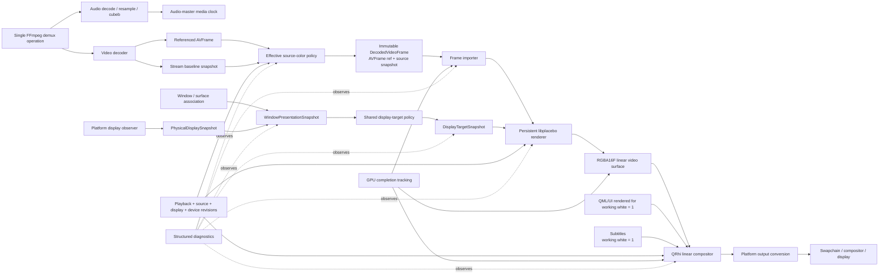
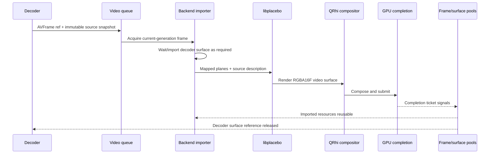
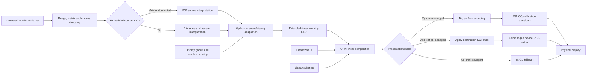

# Sunroom video-rendering and color-management milestone review

> Follow-up (2026-08-01): this imported review is research input, not accepted
> architecture. Exact pinned-source verification and corrections are recorded
> in [the follow-up note](2026-08-01-pinned-color-source-verification.md).
> Accepted source-evidence and display-calibration policy is recorded in
> [ADR 0012](../decisions/0012-use-final-decoded-frames-as-color-evidence.md)
> and
> [ADR 0013](../decisions/0013-rely-on-system-display-calibration.md).
> In particular, a future application-managed display ICC transform belongs
> after whole-surface composition, not in the video-only libplacebo stage.

This review treats display-relative adaptation of **all HDR formats** as a product invariant: PQ, HLG, HDR10+, and Dolby Vision must be adapted to the active desktop reference white and usable display headroom. “Tone-map HDR” does not mean compress everything; it means preserve the intended appearance where possible and compress only what the current environment cannot reproduce. This follows the uploaded research brief.

Evidence labels used below:

* **[Documented]** Public API or specification.
* **[Source]** Established by source inspection.
* **[Inference]** Strong conclusion from documented/source behavior.
* **[Policy]** Recommended Sunroom decision.
* **[Experiment]** Must be validated before claiming support.

---

## 1. Executive recommendation

Sunroom should adopt the proposed display-relative working representation:

[
1.0 = \text{active platform SDR/reference white}
]

[
\text{working headroom} =
\frac{\text{current usable display peak}}{\text{active reference white}}
]

This representation is almost identical to Apple EDR’s native semantics and maps cleanly to Windows scRGB. It can also be described explicitly through Wayland color-management-v1. Apple describes EDR values of 1.0 as SDR/reference white and values above 1.0 as HDR headroom; Windows scRGB instead fixes 1.0 at 80 nits and requires scaling by the current Windows SDR-white setting. ([Apple Developer][1])

The architecture should have three distinct immutable display contracts:

1. `PhysicalDisplaySnapshot`: facts reported about a monitor/output.
2. `WindowPresentationSnapshot`: the color environment currently associated with a particular native surface or window.
3. `DisplayTargetSnapshot`: Sunroom’s policy result for libplacebo and final platform presentation.

This is a necessary correction to the proposed two-stage “physical display snapshot → target” model. Wayland’s preferred image description belongs to a surface, macOS EDR headroom belongs to the current `NSScreen` and can change dynamically, and Windows tells applications to resolve the current output from the window’s location. These are presentation-environment facts, not merely immutable monitor specifications. ([wayland.app][2])

The immediate production milestone should cover:

* Correct SDR interpretation.
* Static PQ/HDR10 on Windows.
* Live Windows reference-white and display-target updates.
* Persistent libplacebo rendering.
* RGBA16F extended-linear composition.
* Exactly one final working-to-scRGB conversion.
* Immutable metadata/display decisions with provenance.
* High-precision captures and deterministic display simulations.

HLG, HDR10+, and Dolby Vision must still follow the same product requirement, but should not be declared supported until their target-luminance semantics have been verified. In particular, the proposed virtual libplacebo target is **not safe as a universal HDR construction**.

---

## 2. Corrections to assumptions in the brief

### Tone mapping is broader than PQ

**[Policy]** The invariant should be named **HDR presentation adaptation**, not PQ scaling.

Intuitively:

* **PQ/HDR10** describes display light in absolute-nit terms.
* **HLG** describes a relative scene signal whose final contrast depends on the target display.
* **HDR10+** adds scene-dependent guidance.
* **Dolby Vision** can add reshaping and target-specific trims.

All must end up relative to the actual desktop reference white and headroom, but they do not reach that result through identical internal mathematics. ITU guidance preserves the region from black through reference white substantially linearly, then introduces highlight compression above it. HLG additionally applies a display-dependent OOTF, so changing its assumed display peak can change contrast below the highlights as well. ([itu.int][3])

### The virtual libplacebo target is not universally valid

libplacebo 7.360.1 defines:

```text
PL_COLOR_SDR_WHITE = 203 cd/m²
PL_HDR_NORM 1.0 = PL_COLOR_SDR_WHITE
```

Its HDR metadata `min_luma` and `max_luma` are documented in physical cd/m². ([GitHub][4])

The construction

[
M_v = 203 \cdot \frac{P}{R}
]

is numerically coherent for the static-PQ core path, where (P) is usable peak and (R) is platform reference white. But it passes a **virtual** value as a field documented as physical luminance. That is a controlled semantic fiction, not a first-class reference-white API.

Worse, libplacebo explicitly changes an HLG source’s `max_luma` to the destination `max_luma` when mapping to an HDR output. Using a virtual 1218-nit destination for a physical 600-nit display therefore causes HLG to be evaluated as though the target display peak were 1218 nits. That can change the HLG OOTF and midtone contrast. ([GitHub][5])

### `pl_frame_copy_stream_props` is not a metadata policy engine

libplacebo documents that some FFmpeg stream-level side data is not propagated to every frame and offers `pl_frame_copy_stream_props` to add it. It does not provide Sunroom’s required conflict policy, provenance, confidence, or diagnostic explanation. ([GitHub][6])

**[Policy]** Use libplacebo’s helpers to parse and map values, but make Sunroom’s immutable `EffectiveSourceDescription` the sole policy decision. Never let a late helper call silently redefine already-resolved frame metadata.

### `QScreen` alone is not sufficient

Qt’s screen signals are useful triggers, but QRhi warns that HDR information belongs to the output with which a swapchain was associated at creation or resize, and moving an initialized swapchain between displays is not well-defined. Microsoft independently recommends resolving the current output from output bounds rather than trusting a stale swapchain output. ([Qt Documentation][7])

### Reported display peak is not necessarily current usable peak

`DXGI_OUTPUT_DESC1` reports color-volume and luminance information, but Windows does not expose a direct Apple-style continuously varying “current EDR headroom” value. Sunroom must distinguish:

* Descriptor or hardware maximum.
* Maximum full-frame luminance.
* Current SDR reference white.
* A conservative policy estimate of currently usable peak.

The last item may have lower confidence than the first three. Microsoft recommends using `DXGI_OUTPUT_DESC1` for tone and gamut mapping, but does not document it as a continuously measured instantaneous panel headroom value. ([Microsoft Learn][8])

### Apple system tone mapping would be a second tone mapper

Setting `CAMetalLayer.edrMetadata` opts the layer into Apple’s media tone mapper. If libplacebo has already adapted the video, doing this would introduce a second tone-mapping stage. Sunroom’s libplacebo-owned path should therefore leave `edrMetadata` unset. ([Apple Developer][9])

---

## 3. Subsystem diagram



No component opens, probes, reads, or decodes the media a second time. Audio and video retain one demux operation and one normalized timeline.

---

## 4. Responsibility and ownership table

| Boundary                    | Responsibility and output                                        | Thread and lifetime                             | Revision identity                            | Native types and failure policy                             |
| --------------------------- | ---------------------------------------------------------------- | ----------------------------------------------- | -------------------------------------------- | ----------------------------------------------------------- |
| Demux operation             | Produces audio/video packets on one timeline                     | Demux worker; operation lifetime                | Playback generation                          | FFmpeg types allowed internally; cancellation closes queues |
| Video decoder               | Produces referenced `AVFrame`s                                   | Decode worker; frame refs cross queue           | Playback generation + decode sequence        | FFmpeg/hardware-frame types allowed                         |
| Stream baseline             | Freezes codec/stream metadata at track configuration             | Created on open or track/property change        | Stream-config revision                       | FFmpeg fields only during construction                      |
| Effective source policy     | Resolves one authoritative description with provenance           | Pure CPU work, normally decode worker           | Effective-source hash/revision               | No mutable native object references                         |
| `DecodedVideoFrame`         | Owns one `AVFrame` reference plus immutable semantic snapshots   | Queue ownership; ref-counted                    | Playback generation + frame identity         | AVFrame allowed; no GPU objects                             |
| Window display association  | Determines actual presentation environment                       | GUI/native-event side; async queries permitted  | Selection revision                           | Native window/display objects remain inside provider        |
| Physical display observer   | Collects capabilities and reported state                         | Platform worker or GUI-safe calls               | Provider generation + capability revision    | Native types private; unknown fields remain unknown         |
| Display-target policy       | Converts presentation facts into libplacebo and output contracts | Pure CPU; any non-realtime thread               | Target-policy revision + target hash         | No native types                                             |
| Frame importer              | Maps software or hardware storage to renderable planes           | Render thread/backend queue                     | Graphics generation + importer generation    | Native GPU types allowed only here                          |
| libplacebo renderer         | Decodes color, scales, tone maps, gamut maps                     | Persistent render-thread object                 | Renderer-policy revision + device generation | `pl_gpu`, `pl_renderer`, shader state                       |
| Rendered-video surface pool | Owns RGBA16F surfaces and completion state                       | Render thread; reuse after GPU completion       | Surface generation + render key              | QRhi/native texture handles in backend only                 |
| QRhi compositor             | Linear blend of video, UI, and subtitles                         | QRhi render thread                              | Composition/swapchain generation             | QRhi objects; no FFmpeg types                               |
| Platform presentation       | Final coordinate/encoding conversion only                        | Render/present thread                           | Presentation generation                      | D3D11/DXGI, Metal/CA, or Wayland objects                    |
| Diagnostics                 | Publishes immutable explanation of all decisions                 | Snapshot publication; no audio callback logging | Diagnostic sequence                          | Serialized semantic state only                              |

QRhi native texture import is non-owning and requires a compatible device/resource context; external resource state transitions must be bracketed through QRhi’s native interop mechanisms. This makes adapter and device identity part of the importer contract, not something the compositor should discover accidentally. ([Qt Documentation][10])

---

## 5. Thread and synchronization model

### CPU ownership

1. The decoder obtains an `AVFrame`.
2. It creates or clones a reference for `DecodedVideoFrame`; this does not copy pixel data.
3. It resolves `EffectiveSourceDescription` from:

    * The final decoded frame.
    * The frozen stream baseline.
    * Explicit fallback policy.
4. The bounded video queue owns that `DecodedVideoFrame`.
5. The renderer obtains its own reference while importing/rendering.

`pl_map_avframe_ex` automatically references the `AVFrame`; the resulting `pl_frame` remains valid until `pl_unmap_avframe`. Some mapped metadata, such as ICC or film-grain data, borrows memory whose validity is tied to the referenced frame. ([GitHub][6])

### GPU sequence



The critical lifetime rule is:

> Recording a GPU command does not end the decoder surface’s lifetime. The surface may be released only after every GPU operation that samples or copies from it has completed.

For software frames, libplacebo upload textures should be pooled and passed through the helper’s reusable texture mechanism. For hardware frames, the imported decoder surface or an explicit copy destination must remain alive until a backend completion ticket signals. `pl_unmap_avframe` ends libplacebo’s frame reference, but Sunroom may still need to retain a native hardware surface if work referencing it remains in another command stream.

### Generation changes

* **Seek/open/fallback:** discard not-yet-imported old-generation frames immediately.
* **Already submitted GPU work:** retire resources only after completion; never force-release them because their playback generation is stale.
* **Device loss:** increment `graphicsDeviceGeneration`; invalidate libplacebo GPU/renderer objects, imports, texture pools, synchronization handles, and target interop.
* **Adapter mismatch:** reject direct import before command recording. Attempt an explicit GPU copy only if the backend supports one; otherwise use a diagnosed CPU fallback.
* **No fixed sleeps:** tests should control barriers, promises, fake completions, or real fence completion.

QRhi commonly keeps multiple frames in flight, so a reusable surface cannot be identified merely by “the next frame has started.” ([Qt Documentation][7])

---

## 6. Effective source-metadata precedence

### FFmpeg propagation behavior

FFmpeg’s decode core fills scalar frame properties such as primaries, transfer, matrix, range, chroma location, alpha mode, sample aspect ratio, and pixel format from the codec context **only when the decoder-produced frame field remains unspecified**. Thus an explicit frame value already wins over the context baseline. ([GitHub][11])

The decode core also maps coded and decoded side data, but propagation varies by side-data type and decoder. libplacebo explicitly documents that some `AVStream` side data remains stream-level and must be copied separately if wanted. ([GitHub][11])

### Recommended precedence table

| Property                         | Effective precedence                                                                        | Notes                                                                                                                                     |
| -------------------------------- | ------------------------------------------------------------------------------------------- | ----------------------------------------------------------------------------------------------------------------------------------------- |
| Pixel storage and format         | Actual decoded `AVFrame::format` and hardware-frame context                                 | Never infer storage from stream metadata                                                                                                  |
| Plane layout and component depth | Actual pixel-format descriptor and mapped frame planes                                      | Distinguish coded bit depth from container storage width                                                                                  |
| YUV versus RGB                   | Actual pixel format and libplacebo representation mapping                                   | RGB is normally full-range; preserve special systems such as ICtCp                                                                        |
| Range                            | Explicit final `AVFrame` → frozen decoder/stream baseline → narrow format-specific fallback | Never infer solely from bit depth                                                                                                         |
| Matrix coefficients              | Explicit frame → stream baseline → codec/container normative fallback → explicit heuristic  | Do not silently use libplacebo’s dimension-based guess                                                                                    |
| Transfer                         | Explicit frame → stream baseline → codec/bitstream facts → explicit fallback                | Never infer HDR from “10-bit”                                                                                                             |
| Primaries                        | Explicit frame → stream baseline → codec/bitstream facts → explicit fallback                | PQ or HLG with missing primaries may warrant a warned BT.2020 convention, not a silent one                                                |
| Chroma location                  | Explicit frame → stream baseline → codec-defined default → unknown                          | Record any default used                                                                                                                   |
| Alpha mode                       | Explicit frame → pixel-format semantics → stream baseline → unknown/opaque policy           | Video should normally render opaque unless alpha is genuinely present                                                                     |
| Mastering display                | Per-frame side data → stream coded side data → absent                                       | Do not carry metadata from the previous frame                                                                                             |
| MaxCLL/MaxFALL                   | Per-frame side data → stream coded side data → absent                                       | libplacebo’s public structure says these fields are ignored by libplacebo itself; retain for diagnostics and future policy. ([GitHub][4]) |
| HDR10+                           | Current frame’s dynamic side data only → absent                                             | Scene/frame changes must create a semantic revision                                                                                       |
| Dolby Vision                     | Current frame RPU/mapping metadata plus stream profile/config                               | Profile and enhancement-layer support must be explicit                                                                                    |
| ICC profile                      | Valid frame profile → stream profile where applicable                                       | Treat as a coherent profile; warn on disagreement with scalar tags                                                                        |
| Interlace/field order            | Frame flags → stream baseline → unknown                                                     | Neighbouring field/frame identities become part of the render key                                                                         |
| Sample aspect ratio              | Frame → stream/codec baseline → 1:1 only under explicit policy                              | Geometry, not color                                                                                                                       |
| Rotation/display matrix          | Frame side data → stream display matrix → identity                                          | Geometry, not color                                                                                                                       |
| Crop/display dimensions          | Decoded frame crop and SAR                                                                  | Keep separate from pixel storage and color                                                                                                |

### Immutable result

```text
EffectiveSourceDescription
    pixel representation
    bit encoding
    range
    matrix
    transfer
    signal primaries
    mastering primaries
    chroma location
    alpha mode
    static HDR metadata
    dynamic HDR metadata
    Dolby Vision mode/profile
    interlace/field semantics
    geometry
    provenance[field]
    confidence[field]
    warnings[]
    semantic hash
```

**[Policy]** This immutable object is the only source-color truth used by rendering and diagnostics. The original AVFrame and stream fields remain visible as evidence, but they are not independently mutable “current color settings.”

### Using libplacebo helpers

Recommended sequence:

1. Preserve the original referenced `AVFrame`.
2. Resolve Sunroom’s effective source snapshot.
3. Call `pl_map_avframe_ex` to obtain plane representation and textures.
4. Apply the already-resolved effective color representation to the resulting `pl_frame`.
5. Do not blindly call `pl_frame_copy_stream_props` afterward as a policy operation.
6. Unmap after render submission has finished using the mapping, while separately respecting native surface GPU completion.

libplacebo’s `pl_frame_from_avframe` fills frame description but not textures; `pl_map_avframe_ex` performs the higher-level GPU mapping and maintains an AVFrame reference until unmapping. ([GitHub][6])

---

## 7. Cross-platform display-information comparison

| Capability                  | Windows                                                                                         | macOS                                                                                             | Wayland                                                                                                      | Unsupported Wayland/X11           |
| --------------------------- | ----------------------------------------------------------------------------------------------- | ------------------------------------------------------------------------------------------------- | ------------------------------------------------------------------------------------------------------------ | --------------------------------- |
| Reference-white value       | `DISPLAYCONFIG_SDR_WHITE_LEVEL`; exact conversion to nits                                       | EDR 1.0 is current SDR/reference white, but the absolute-nit value may be less directly exposed   | Parametric descriptions can include reference luminance                                                      | Usually unknown                   |
| Current usable headroom     | No direct general EDR-style value; policy estimate required                                     | Current EDR headroom is exposed and dynamic                                                       | Surface preferred/output descriptions provide target information, but compositor policy governs presentation | Treat as 1.0                      |
| Potential/hardware peak     | `DXGI_OUTPUT_DESC1` max and full-frame luminance                                                | Potential/reference EDR headroom                                                                  | Target luminance in image description                                                                        | Unreliable or unavailable         |
| Display primaries           | `DXGI_OUTPUT_DESC1`                                                                             | Screen/color-space information                                                                    | Encoding and target primaries are separately described                                                       | ICC/XRandR data may be incomplete |
| Change notification         | Classic Win32 lacks a complete Advanced Color event; use events plus `IDXGIFactory1::IsCurrent` | Window/screen and screen-parameter notifications; dynamic headroom may require bounded resampling | `image_description_changed` and surface `preferred_changed2`                                                 | Desktop-specific                  |
| Window/output association   | Greatest intersection of output and window bounds is Microsoft’s recommendation                 | `NSWindow.screen` and screen-change notification                                                  | Surface preferred image description is more authoritative than choosing a `wl_output` manually               | Desktop/window-system heuristics  |
| Presentation form           | FP16 scRGB canonical desktop HDR path                                                           | FP16 Metal EDR with extended-linear color space                                                   | Explicit surface image description                                                                           | SDR sRGB                          |
| Who performs HDR adaptation | Sunroom/libplacebo                                                                              | Sunroom/libplacebo                                                                                | Sunroom/libplacebo; compositor handles conversion to outputs                                                 | Sunroom maps HDR to SDR           |
| Honest fallback             | HDR-to-SDR target with headroom 1                                                               | EDR unavailable → SDR target                                                                      | No protocol/support → SDR target                                                                             | SDR only                          |

### Windows

`DISPLAYCONFIG_SDR_WHITE_LEVEL` gives the current SDR-white level as a multiplier of 80 nits multiplied by 1000:

[
R_{\text{nits}} =
\frac{\text{SDRWhiteLevel}}{1000} \cdot 80
]

Microsoft’s examples map 1000 to 80 nits and 2000 to 160 nits. ([Microsoft Learn][12])

For Win32 desktop applications, Microsoft recommends:

* Querying `IDXGIFactory1::IsCurrent` during the render loop.
* Re-enumerating outputs when it becomes false.
* Handling window changes such as `WM_SIZE`.
* Resolving the active output by the greatest intersection with the window bounds.
* Not relying on `GetContainingOutput` after the factory has become stale. ([Microsoft Learn][8])

**[Policy]** Calling `IsCurrent` is an inexpensive revision guard, not permission to perform all DisplayConfig and EDID work every frame. Coalesce the actual reprobe asynchronously.

Suggested Windows value confidence:

* SDR reference white: **high** when query succeeds.
* Active HDR/scRGB mode: **high**.
* Reported primaries: **medium/high**, preserving source.
* Reported max luminance: **medium**.
* Current usable peak: **medium/low**, derived conservatively.
* EDID fallback peak: **low/medium**.

### macOS

Apple’s EDR model directly matches Sunroom’s intended working coordinates:

* 0.0 is black.
* 1.0 is SDR/reference white.
* Values above 1.0 use EDR headroom.
* Current headroom can vary with brightness, environment, system conditions, and competing content.
* EDR Metal rendering uses an extended-range color space and typically RGBA16Float. ([Apple Developer][1])

**[Policy]**

* Use the QRhi Metal backend or a narrow Metal interop path, not a mandatory MoltenVK detour.
* Set `wantsExtendedDynamicRangeContent`.
* Use an appropriate extended-linear color space.
* Leave `CAMetalLayer.edrMetadata` unset because libplacebo owns adaptation.
* Requery on window-screen and screen-parameter notifications.
* While a visible HDR frame is paused, perform a bounded, low-frequency sample of current headroom unless a reliable event for every headroom change is established.

That last polling policy remains **[Experiment]** because Apple documents querying and screen-change handling, but does not provide a clearly documented universal notification for every current-headroom fluctuation.

### Wayland

color-management-v1 separates:

* Image encoding primaries and transfer.
* Reference luminance.
* Target primaries.
* Target minimum and maximum luminance.
* Output image descriptions.
* Surface preferred image descriptions.
* The image description explicitly assigned to a surface.

Descriptions are immutable. When the output description or surface preference changes, the client requests a new description. Surface description changes are double-buffered with `wl_surface.commit`. The compositor may then transform the surface appropriately for each output. ([wayland.app][2])

**[Policy]**

* Prefer the surface’s preferred parametric description over attempting to identify a single “physical owner” output.
* Construct an exact parametric description for Sunroom’s final surface where supported.
* Do not assume the protocol’s predefined Windows-scRGB description supplies the reference-white and target-volume facts Sunroom needs.
* When color-management-v1 is unavailable, tone-map into SDR sRGB and report that HDR display output is unavailable.
* Do not claim HDR on generic X11 merely because a 10-bit or floating-point buffer exists.

---

## 8. Display snapshot proposal

### `PhysicalDisplaySnapshot`

```text
identity
    provider name
    stable native identity components
    adapter identity
    connection/topology identity

capability
    extendedRangeSupported
    activeColorMode
    encodingPrimaries
    physicalOrTargetPrimaries
    reportedMinimumNits
    reportedMaximumNits
    reportedMaximumFullFrameNits
    potentialHeadroom
    refreshRate

metadata
    provenance per field
    confidence per field
    queriedAt
    providerGeneration
    capabilityRevision
    nativeTopologyRevision
    refreshReason
```

### `WindowPresentationSnapshot`

```text
windowIdentity
selectionRevision
selectedPhysicalDisplayIdentity, optional
selectionReason
surfacePreferredDescriptionIdentity, optional

extendedRangeActive
activeReferenceWhiteNits, optional
currentUsablePeakNits, optional
potentialPeakNits, optional
currentHeadroom
outputCoordinateModel
outputColorMode
presentationPrimaries
minimumLuminance

physicalSnapshotRevision
snapshotRevision
provenance and confidence
refreshReason
```

This layer represents what the window or surface can use **now**, not merely what a monitor could theoretically do.

### `DisplayTargetSnapshot`

```text
workingContract
    transfer = linear
    coordinatePrimaries
    workingWhiteDefinition
    usefulMinimum
    usefulMaximum

libplaceboTarget
    signal primaries
    gamut boundary
    min_luma
    max_luma
    tone mapper
    gamut mapper
    peak-detection policy
    dynamic-metadata policy

presentation
    platform encoding
    final linear scale
    image description or swapchain color space
    systemToneMappingEnabled = false

identity
    policyRevision
    semanticHash
    sourcePresentationRevision
```

### Window spanning several displays

**[Policy]**

1. Use the platform’s actual surface/window association to drive output encoding.
2. Record largest video-viewport intersection as a diagnostic/content hint.
3. Do not target a monitor inconsistent with the swapchain or compositor’s actual owner.
4. If a manual fallback selection is required, use:

    * Largest video-viewport intersection.
    * A meaningful hysteresis margin.
    * A short debounce while dragging.
    * Immediate switch in exclusive or borderless fullscreen.
5. On Wayland, prefer the compositor-provided surface description instead of recreating Windows-style ownership logic.

Every asynchronous query carries:

```text
windowIdentity
selectionRevision
requestedDisplayIdentity
observerGeneration
```

Publish its result only if all values still match current state. Cancellation alone is insufficient because an old query can complete successfully after a newer one.

---

## 9. Display revision and invalidation model

### Revisions

| Revision                             | Changes when                                                                 |
| ------------------------------------ | ---------------------------------------------------------------------------- |
| Playback generation                  | Open, seek, fallback, track reset                                            |
| Frame identity                       | New decoded content frame                                                    |
| Effective-source revision            | Resolved metadata or geometry changes                                        |
| Display-selection revision           | Window’s presentation environment changes                                    |
| Display-capability revision          | Reference white, headroom, gamut, HDR mode, or relevant display facts change |
| Display-target-policy revision       | Mapping policy or confidence fallback changes                                |
| Graphics-device generation           | Device loss or recreation                                                    |
| Renderer-policy revision             | Tone mapper, gamut mapper, peak-detection policy changes                     |
| Target-interop generation            | Imported output/QRhi/native target changes                                   |
| Presentation generation              | Swapchain or surface presentation object changes                             |
| Rendered-surface completion revision | GPU completion/reuse state changes                                           |

### Rendered-video reuse key

```text
RenderedVideoKey {
    playbackGeneration,
    decodedFrameIdentity,
    effectiveSourceSemanticHash,
    displayTargetSemanticHash,
    rendererPolicyRevision,
    graphicsDeviceGeneration,
    targetInteropGeneration,
    outputExtent,
    deinterlaceNeighbourIdentities
}
```

A swapchain recreation does not automatically require rerendering the video surface if the display target, output extent, coordinate basis, and graphics domain remain compatible. It may require only recomposition. A device recreation always invalidates GPU surfaces.

A paused frame rerenders when:

* Effective source metadata changes.
* Active presentation environment changes.
* Reference white changes.
* Current usable peak/headroom changes materially.
* Display gamut or HDR mode changes.
* Renderer policy changes.
* Device or interop generation changes.
* Output extent changes enough to invalidate the chosen render resolution.

It does **not** rerender because a button animates, the seek indicator changes, or another unrelated QML property changes.

---

## 10. Verdict on the libplacebo virtual-target model

## Static PQ verdict: accepted with constraints

Let:

* (R) = active reference white in nits.
* (P) = current usable display peak in nits.
* (H = P/R) = available relative headroom.
* (W) = Sunroom working value.

The proposed libplacebo target is:

[
M_v = 203H = 203\frac{P}{R}
]

libplacebo’s normalized linear scale is:

[
1.0 = 203\text{ nits}
]

Therefore the target’s numerical output maximum becomes:

[
\frac{M_v}{203} = H
]

On Windows:

[
S_{\text{scRGB}} = W\frac{R}{80}
]

Since Windows scRGB 1.0 means 80 nits:

[
L_{\text{physical}} = 80S_{\text{scRGB}} = WR
]

Thus:

* (W=1) produces (R) nits.
* (W=H) produces (P) nits.

For a 600-nit target and 100-nit reference white:

```text
headroom = 600 / 100 = 6
libplacebo virtual max = 203 × 6 = 1218
working range = 0…6
Windows scale = 100 / 80 = 1.25
working 1.0 -> scRGB 1.25 -> 100 nits
working 6.0 -> scRGB 7.5 -> 600 nits
```

This is mathematically coherent. libplacebo also caps tone-map output to the source maximum when inverse tone mapping is disabled, preventing automatic expansion merely because more target headroom is available. ([GitHub][13])

### Important limits

1. **The destination field is documented as physical cd/m².**
   Passing 1218 for a physical 600-nit display is not semantically honest outside this numerical use.

2. **The coordinate construction does not guarantee the tone mapper preserves 203 nits exactly.**
   A scene-adaptive or spline mapper may move midtones or reference white while solving the overall range transformation. The formula establishes output capacity, not every point of the curve.

3. **Peak detection can change the effective source range.**
   That may be desirable for bad or missing metadata, but its state must reset on seek/open/generation change and must not redefine Sunroom’s reference-white anchor. libplacebo requires successive frames from one source to share peak-detection state and exposes an explicit reset. ([GitHub][14])

4. **Pin rendering policy.**
   libplacebo 7’s defaults are spline tone mapping and perceptual gamut mapping. Sunroom should set these explicitly so upgrades do not silently alter output. ([GitHub][14])

### HLG verdict: rejected pending a better separation

libplacebo 7 sets the HLG source peak to the HDR destination peak during color-space inference. A virtual destination therefore changes HLG’s assumed display OOTF. ([GitHub][5])

**[Policy]** Do not ship HLG using the universal virtual-target formula until one of these is established:

* A libplacebo API that separately represents physical HLG target peak and output reference-white scaling.
* A verified source-supported configuration that prevents virtual target luminance from contaminating HLG’s OOTF.
* An upstream libplacebo change introducing that separation.

This is a concrete libplacebo limitation for Sunroom’s required contract. The right response is an upstream API discussion or patch, not a Sunroom-authored HLG/tone-mapping shader.

### HDR10+ and Dolby Vision verdict: unresolved

HDR10+ metadata includes scene-dependent luminance and optional target-specific OOTF information in physical units. Dolby Vision may contain target-display trims and reshaping behavior. A virtual target might therefore select or evaluate dynamic guidance as though the display were physically brighter than it is. libplacebo’s structures contain HDR10+ scene maxima, scene average, and target luminance fields in cd/m². ([GitHub][4])

**[Experiment]** Static-PQ success does not prove dynamic-HDR correctness. Test target semantics independently before enabling these paths.

### Tone-mapper recommendation

Do not accept the default spline merely because it is the default. Compare at least:

* libplacebo spline.
* libplacebo BT.2390.
* A no-op case when the source range fits.
* Static metadata versus detected peak.

Select the built-in operator that best maintains:

* Working/reference white near 1.0.
* Near-linear behavior below reference white.
* No expansion into unused headroom.
* Smooth monotonic roll-off only above the available range.
* Stable scene transitions.

The decision is an experiment and ADR, not a user preference.

---

## 11. Expected SDR, PQ, and HLG behavior

| Source                   | Expected behavior                                                                                                                                      |
| ------------------------ | ------------------------------------------------------------------------------------------------------------------------------------------------------ |
| BT.601 limited SDR       | Decode limited range and correct 601 matrix; SDR white maps to working 1.0                                                                             |
| BT.601 full SDR          | Decode full range without limited-range expansion; working white remains 1.0                                                                           |
| BT.709 limited/full SDR  | Correct range, matrix and transfer; no inverse tone mapping                                                                                            |
| BT.2020 SDR              | Decode SDR transfer, retain wide-gamut colors, gamut-map only when target gamut requires it                                                            |
| 8/10/12-bit SDR          | Bit depth affects quantization precision, not HDR classification                                                                                       |
| PQ/HDR10 complete        | Decode absolute PQ; adapt reference region to working 1.0; preserve fitting highlights; roll off excess                                                |
| PQ missing metadata      | Use explicit transfer/primaries; determine effective peak conservatively from valid evidence or peak detection; report uncertainty                     |
| Misleading mastering max | Do not assume mastering-display maximum equals actual content peak                                                                                     |
| HLG                      | Apply the correct physical-display-dependent OOTF, then satisfy the same display-relative working contract; currently gated by target-model experiment |
| HDR10+                   | Re-evaluate scene metadata per frame/scene without carrying stale values                                                                               |
| Dolby Vision             | Apply only profile/path behavior actually implemented; use valid HDR10 fallback when available                                                         |
| HDR track to SDR track   | New effective-source revision and target mapping; no player restart or second demux                                                                    |
| Resolution/color change  | Reconfigure import surfaces as needed and rerender under a new semantic source revision                                                                |
| Contradictory metadata   | Frame evidence wins over baseline; produce diagnostic warning and retain all originals                                                                 |

For an HDR source on an SDR-only target:

```text
reference white = target white
usable peak = reference white
headroom = 1
```

libplacebo must map highlights into the SDR range. This is not a degraded “disable HDR processing” path; it is the normal HDR-to-SDR presentation target.

For an HDR display with sufficient headroom, values that fit should pass without compression. “Tone mapping enabled” does not imply that every pixel is modified.

---

## 12. Output gamut and extended-linear representation

The proposed RGBA16F representation is sound:

```text
transfer: linear
coordinate basis: BT.709/sRGB primaries
working 1.0: active reference white
values below 0 and above 1 allowed
```

QRhi documents `HDRExtendedSrgbLinear` as 16-bit floating-point extended linear sRGB/scRGB with Rec.709 primaries, with conversion to the display’s native color space performed by the window system; on Windows it is the canonical desktop HDR format. ([Qt Documentation][7])

libplacebo distinguishes:

* `pl_color_space.primaries`: signal/output coordinate primaries.
* `pl_color_space.hdr.prim`: mastering or target gamut boundary used by its gamut mapping.
* `transfer`: output transfer.
* `hdr.min_luma` and `hdr.max_luma`: luminance range.

Source inspection shows gamut mapping uses source and destination `hdr.prim`, while output coordinates use the destination signal primaries. This supports a Rec.709/scRGB coordinate basis with a wider target gamut encoded through negative and greater-than-one components. ([GitHub][13])

Recommended destination:

```text
primaries = BT.709
transfer = linear
hdr.prim = trusted target display gamut
hdr.min_luma = target minimum
hdr.max_luma = selected target model
```

Do not leave `hdr.prim` unintentionally empty; libplacebo inference may then fall back to signal primaries, effectively restricting the gamut boundary to BT.709.

Potential loss points requiring tests:

* Any shader `clamp`, `saturate`, `min(max())`, or sigmoid.
* UNORM intermediate textures.
* Incorrect blend state.
* QML texture conversion into an SDR format.
* Premultiplied alpha applied in nonlinear space.
* Swapchain created in an SDR color space.
* Platform system tone mapping enabled after libplacebo.
* Capture through an 8-bit screenshot API.

libplacebo explicitly warns that its sigmoid shader clamps to `[0,1]` and must not be applied to already-decoded HDR content. ([GitHub][14])

### Composition contract

* Video surface: opaque, extended linear, working coordinates.
* QML/UI texture: converted to linear working coordinates before blending.
* Subtitle white: working 1.0.
* Ordinary UI white: working 1.0.
* Blend: premultiplied alpha in linear light.
* Final platform conversion: once, after composition.

A major experiment remains: verify Qt Quick’s exact color and alpha behavior when rendered into the selected FP16 composition path. Do not assume QML’s ordinary authored sRGB values arrive as correctly linearized working values.

---

## 13. Diagnostic snapshot proposal

Diagnostics should be structured state first and logs second.

### Source section

```text
container and stream index
codec and profile
pixel format
component depth and storage width
software/hardware storage type
hardware device and adapter identity
original AVFrame scalar color fields
original frame side data
frozen stream baseline
effective range/matrix/transfer/primaries/chroma/alpha
static mastering and content-light metadata
HDR10+ presence and identifiers
Dolby Vision profile, level and active path
interlace, field order, SAR, crop, display transform
provenance and confidence per effective field
contradictions, fallbacks and warnings
effective-source hash/revision
```

### Display section

```text
window identity
presentation-environment identity
physical display identity where available
selection reason
HDR/extended-range active state
active reference white
current usable peak
potential/reported peak
full-frame peak
minimum luminance
current headroom
display/target primaries
output color mode
field provenance and confidence
selection and capability revisions
native topology revision
last refresh reason and timestamp
```

### Rendering section

```text
libplacebo version
GPU backend and adapter
import path
direct share / GPU copy / CPU transfer
copy and transfer counts
source representation passed to libplacebo
target coordinate basis
target gamut boundary
target min/max
relative headroom
tone mapper and parameters
gamut mapper and parameters
peak-detection state and reset generation
dynamic-metadata mode
Windows scRGB scale or platform equivalent
system tone mapper enabled/disabled
sync mechanism
graphics and interop generations
rendered-video key
surface reused or rerendered
last invalidation reason
fallback reason
```

### Logging policy

Log on:

* Open/track change.
* Effective metadata change.
* Display-target revision.
* Import fallback.
* Device loss/recreation.
* Unexpected CPU transfer.
* Contradictory metadata.
* Stale query rejection.
* Renderer-policy change.

Do not log every frame during normal steady-state playback, and never log from cubeb’s real-time callback.

---

## 14. Regression fixture and test matrix

### Initial media corpus

Use generated or freely redistributable real containers decoded by production FFmpeg:

| Fixture family   | Variants                                                                    |
| ---------------- | --------------------------------------------------------------------------- |
| SDR ranges       | BT.601 limited/full; BT.709 limited/full                                    |
| SDR gamut        | BT.709 and BT.2020 SDR                                                      |
| Precision        | 8-, 10-, and 12-bit                                                         |
| Chroma           | Common MPEG-2/JPEG/DV chroma locations                                      |
| PQ               | Complete HDR10 metadata; missing metadata; contradictory metadata           |
| HLG              | Controlled grayscale and color patches                                      |
| Wide gamut       | Colors outside ordinary sRGB, including negative-scRGB expected coordinates |
| Dynamic metadata | HDR10+ scene transition                                                     |
| Dolby Vision     | Profile-specific minimal fixtures plus valid HDR10 fallback                 |
| Frame changes    | Resolution, range, transfer, primaries and metadata transitions             |
| Geometry         | SAR, crop, rotation, interlace and field order                              |
| Lifecycle        | Pause, seek, display movement, stale query, device recreation               |

### Analytical PQ patches

Construct 50, 100, 203, 400, 600, and 1000-nit neutral patches for:

```text
reference white: 80, 100, 203 nits
display peak:    400, 600, 1000 nits
```

For each combination verify:

* Working 1.0 corresponds to the selected reference white.
* The 203-nit source patch is approximately 1.0 before tone-mapping modification.
* The selected production operator preserves the intended reference anchor.
* Output never exceeds current headroom.
* Fitting highlights are not compressed.
* Excess highlights roll off monotonically.
* Lower-peak content is not expanded to consume target peak.
* Windows final scaling occurs once.

### Provisional numerical thresholds

These should be tightened after baseline measurements:

| Test                                                       | Initial tolerance                                                        |
| ---------------------------------------------------------- | ------------------------------------------------------------------------ |
| Metadata values and revision logic                         | Exact                                                                    |
| SDR neutral/range patches                                  | Max absolute error ≤ 0.002 working units                                 |
| Opaque QRhi composition                                    | Max absolute RGB error ≤ 0.002                                           |
| PQ identity/reference patches where no mapping is required | Relative error ≤ 0.5%, or absolute ≤ 0.005                               |
| Peak limit                                                 | No pixel above target headroom by more than 0.5%                         |
| No-expansion test                                          | Output peak ≤ source peak × 1.005                                        |
| Monotonic tone curve                                       | No decreasing output for increasing neutral input                        |
| General real-GPU capture                                   | Mean and p99 thresholds recorded separately; no exact cross-GPU equality |
| Wide-gamut path                                            | Compare in XYZ or ICtCp, not merely clipped RGB                          |

For mapped highlights, avoid treating a golden produced by the same implementation as the sole oracle. Test independent properties: anchor, monotonicity, output bound, continuity around the knee, and known analytical patches.

### CI tiers

**Every change**

* Real FFmpeg software decode.
* Real libplacebo offscreen render.
* Metadata precedence.
* PQ patch matrix.
* Simulated display providers.
* Stale-query and revision races.
* RGBA16F captures.

**Nightly real GPU**

* D3D11/Vulkan/Metal as available.
* Production QRhi compositor.
* Validation layers.
* Repeated seeks.
* Texture-pool and allocation checks.
* Negative and extended RGB survival.

**Platform display tests**

* Move window between displays.
* Toggle HDR/Advanced Color.
* Change Windows SDR white.
* Change macOS brightness/headroom.
* Wayland preferred-description changes.
* Hotplug, sleep/wake and fullscreen.

**HDR lab**

* Actual HDR displays.
* Colorimeter or spectroradiometer.
* Reference-white and highlight luminance.
* Display gamut.
* Long-play thermal/brightness behavior.
* Verification that compositor and display behavior match offscreen predictions.

Offscreen EXR output can establish mathematical correctness, not physical display correctness.

---

## 15. Smallest coherent immediate implementation slice

### Scope

Deliver trustworthy SDR and static HDR10/PQ playback on Windows while creating the final semantic seams needed by HLG, dynamic metadata, hardware frames, macOS, and Wayland.

### Work

1. **Freeze semantic contracts**

    * `EffectiveSourceDescription`.
    * `DecodedVideoFrame`.
    * `PhysicalDisplaySnapshot`.
    * `WindowPresentationSnapshot`.
    * `DisplayTargetSnapshot`.
    * `RenderedVideoKey`.

2. **Implement metadata resolution**

    * Use final AVFrame fields as primary evidence.
    * Merge missing stream baseline properties with provenance.
    * Preserve unspecified values.
    * Expose contradictions.

3. **Create the production importer seam**

    * Software AVFrames through `pl_map_avframe_ex`.
    * Reusable upload textures.
    * Explicit import-path diagnostics.
    * No pixel copy merely to obtain a Sunroom-owned structure.

4. **Keep libplacebo persistent**

    * Persistent renderer and tone-map state per graphics domain.
    * Reset scene state on seek/open/source generation.
    * Explicitly pin tone/gamut policy.

5. **Implement deterministic display simulation**

    * Two displays with independently controlled reference white, peak, gamut and revisions.
    * Out-of-order asynchronous query completion.
    * Pause and rerender tests.

6. **Implement the Windows provider**

    * DisplayConfig identity and SDR-white query.
    * DXGI output description.
    * Window/output resolution.
    * `IsCurrent` revision guard.
    * Coalesced asynchronous reprobe.

7. **Implement static-PQ target mapping**

    * Virtual target limited to an explicitly named `StaticPqRelativeTargetV1`.
    * No generic “HDR target formula” abstraction.
    * Inverse tone mapping disabled.
    * Selected built-in tone mapper after patch experiments.

8. **Verify final composition**

    * RGBA16F linear video.
    * Linear QML/subtitle composition.
    * Exactly one Windows scale of `referenceWhite/80`.
    * No system or swapchain tone mapper after libplacebo.

9. **Add diagnostics and captures**

    * Structured snapshot.
    * EXR/raw-half capture.
    * Invalidation reason.
    * CPU/GPU-copy counters.

### Acceptance criteria

* Correct 601/709 limited/full SDR.
* SDR/UI/subtitle white agree at working 1.0.
* Static PQ changes physical brightness when Windows reference white changes.
* A paused PQ frame rerenders after target revision.
* Fitting highlights pass without compression.
* Excess highlights remain bounded and smoothly compressed.
* Lower-peak content is not expanded.
* No duplicate media operation.
* No silent CPU transfer.
* No stale display result can overwrite a newer selection.
* No libplacebo recreation per frame.
* No per-frame platform capability reprobe.
* No second tone mapper.

### Commit boundaries

1. Semantic value types and ADRs.
2. Effective source metadata and provenance.
3. `DecodedVideoFrame` ownership.
4. Persistent importer/renderer path.
5. Simulated display provider and revision tests.
6. Windows display provider.
7. Static-PQ target policy.
8. QRhi/presentation verification.
9. Diagnostics and regression corpus.

### Explicitly deferred from this slice

* Production HLG claim.
* Production HDR10+ claim.
* Dolby Vision claim.
* Hardware zero-copy.
* macOS EDR provider.
* Wayland color-management-v1.
* ICC-profile rendering beyond retaining and diagnosing metadata.
* Physical HDR certification.

---

## 16. Larger staged implementation roadmap

### Stage A — Semantic contracts and experiments

**Purpose:** Remove ambiguous units and mutable color state.

**Deliverables:** Immutable contracts, diagnostics skeleton, static-PQ virtual-target harness, HLG target experiment.

**Gate:** Do not generalize the virtual formula before the HLG and dynamic-HDR results.

**Tests:** Pure semantic/revision tests plus real libplacebo analytical patches.

**Acceptance:** Every luminance value has units, provenance, confidence and one owner.

---

### Stage B — Effective source-color pipeline

**Purpose:** Make FFmpeg interpretation trustworthy.

**Deliverables:** Frame/stream precedence, provenance, SDR ranges/matrices, static HDR metadata, immutable decoded-frame boundary.

**Risks:** Silent FFmpeg/libplacebo inference and stale dynamic side data.

**Acceptance:** Every rendered field can be traced to frame, stream, codec rule, or explicit fallback.

**Parallelism:** Can proceed alongside Windows display observation.

---

### Stage C — Live Windows presentation environment

**Purpose:** Make target facts live rather than startup-only.

**Deliverables:** DisplayConfig/DXGI provider, reference white, output selection, revisioning, simulated provider.

**Tests:** Movement, target changes, stale async results, paused-frame invalidation.

**Acceptance:** No obsolete display result can publish; paused content updates without resume.

---

### Stage D — Static PQ and Windows scRGB

**Purpose:** Deliver the first trustworthy HDR product path.

**Deliverables:** Explicit static-PQ policy, target gamut, extended RGB preservation, final scRGB scale.

**Gate:** Analytical patch tests and no-double-mapping audit.

**Acceptance:** SDR and static HDR10 pass capture tests and initial physical measurements.

---

### Stage E — Player-level integration

**Purpose:** Make the production Player page use the path automatically.

**Deliverables:** Open, play, pause, seek, display move, target update, shutdown and device recreation.

**Diagnostics:** HDR Lab remains an inspection page, not an alternate renderer.

**Acceptance:** Video rerenders only for semantic reasons; ordinary UI changes recompose only.

---

### Stage F — HLG and dynamic metadata

**Purpose:** Fulfil the product requirement for HDR beyond static PQ.

**Research gates:**

* Separate physical HLG target peak from working-reference scaling.
* Establish HDR10+ target-unit behavior.
* Define Dolby Vision profile matrix and fallback rules.

**Tests:** Real HLG OOTF patches, HDR10+ scene changes, profile-specific Dolby Vision fixtures.

**Acceptance:** Each format has a documented and experimentally verified target model.

---

### Stage G — Hardware-frame import

**Purpose:** Eliminate unnecessary CPU transfers.

**Deliverables:** D3D11VA, VAAPI/DRM PRIME and VideoToolbox importers through the existing frame boundary.

**Tests:** Adapter mismatch, synchronization, decoder-pool pressure, seek cancellation and device loss.

**Acceptance:** Normal supported hardware playback performs no CPU download; all fallback copies are diagnosed.

---

### Stage H — macOS and Wayland

**Purpose:** Implement native live presentation semantics without leaking them into playback.

**macOS:** Metal/EDR surface, current headroom observation, reference/potential headroom, no CA system tone mapper.

**Wayland:** color-management-v1 surface descriptions, preferred-description changes, honest SDR fallback.

**Acceptance:** Equivalent working values have equivalent semantic meaning on all platforms, even though final encoding differs.

---

### Stage I — Reliability, performance and physical validation

**Purpose:** Make the result production-grade.

**Work:** Validation layers, long playback, repeated seek, hotplug, suspend/resume, multi-monitor movement, device loss, memory growth, copy accounting and colorimeter testing.

**Acceptance:** No unbounded resource retention, silent fallback, stale target, or double tone mapping under stress.

### Format support gates

* **SDR:** after Stage B plus production compositor tests.
* **Static HDR10/PQ:** after Stage D and physical validation.
* **HLG:** blocked until Stage F’s physical-peak/OOTF problem is solved.
* **HDR10+:** blocked until dynamic metadata is observed and target semantics are verified.
* **Dolby Vision:** blocked until profile-specific support, reshaping, enhancement-layer behavior and fallback are explicitly implemented.
* **Hardware decode:** not required for format correctness, but required before claiming efficient hardware playback.

---

## 17. Suggested architecture-decision records

1. **Working-light and reference-white units**
2. **Effective source metadata precedence and provenance**
3. **AVFrame ownership and decoder-surface lifetime**
4. **Physical display versus window presentation environment**
5. **Static-PQ virtual libplacebo target scope**
6. **HLG physical target peak and reference-white separation**
7. **Output coordinate primaries and target gamut boundary**
8. **Rendered-video reuse and revision key**
9. **Platform presentation and prohibition of double tone mapping**
10. **Peak detection and scene-state reset**
11. **Graphics domain per device/window compatibility group**
12. **Diagnostics and independent rendering oracles**
13. **Fallback hierarchy and mandatory copy reporting**

---

## 18. Highest-risk assumptions requiring experiments

1. A 203-nit PQ patch remains near working 1.0 under the chosen production tone mapper.
2. The virtual target remains stable across libplacebo upgrades.
3. HLG can be given a physical OOTF peak independently of the relative working range.
4. HDR10+ target-luminance behavior is not corrupted by virtual target nits.
5. Dolby Vision reshaping/trims receive correct target semantics.
6. Negative and greater-than-one RGB survive libplacebo, QRhi blending and the swapchain.
7. Qt Quick UI reaches the compositor in the intended linear, premultiplied form.
8. Windows descriptor luminance is a suitable conservative estimate for usable peak.
9. Windows SDR-white changes are always detected promptly with the selected event/reprobe strategy.
10. macOS current EDR headroom changes can be observed reliably enough for paused content.
11. Qt/QRhi exposes enough Wayland native integration to assign color-management-v1 image descriptions without broad platform leakage.
12. Hardware decoder completion and QRhi/libplacebo consumption can share or bridge synchronization without hidden stalls.
13. A single graphics domain can serve all windows on the same adapter; cross-adapter windows may require separate domains.

Any failure in items 3–5 should trigger reassessment of the target API, not the addition of an untracked post-render multiplier or custom transfer shader.

---

## 19. Explicitly deferred work

* Handmade PQ, HLG, gamut or highlight-compression shaders.
* Universal dynamic-HDR claims.
* Dolby Vision profile 7 FEL support unless actually decoded and combined.
* Passing metadata through to a display while simultaneously tone-mapping it in Sunroom.
* General plugin systems for graphics or color backends.
* A new abstraction duplicating QRhi resource and command concepts.
* Per-display rendering of different regions of one spanning window.
* Perfect HDR output on unsupported Wayland compositors or X11.
* Treating EDID peak as guaranteed current luminance.
* Full ICC workflow until the platform presentation and working-space contracts are stable.
* Hardware-frame zero-copy before ownership and synchronization contracts exist.
* Exact pixel equality across unrelated GPU implementations.

---

## 20. Architectural mistakes to avoid

* Treating the static-PQ virtual target as a universal HDR formula.
* Calling all HDR “PQ.”
* Compressing highlights even when they fit.
* Expanding content merely because extra display headroom exists.
* Letting scene peak detection move the reference-white contract unnoticed.
* Allowing libplacebo and the platform to tone-map the same content.
* Applying Windows’s `referenceWhite/80` factor before video/UI composition.
* Applying that Windows-specific scale on macOS or Wayland.
* Setting Apple `CAEDRMetadata` after libplacebo mapping.
* Keeping source metadata in multiple mutable structures.
* Replacing unspecified metadata silently with BT.709.
* Treating `pl_frame_copy_stream_props` as precedence resolution.
* Carrying HDR10+ or Dolby Vision metadata from an earlier frame.
* Releasing decoder surfaces after command recording rather than GPU completion.
* Downloading all hardware frames to CPU memory as the normal path.
* Importing a texture created on a different adapter/device without detection.
* Recreating libplacebo per frame.
* Querying expensive platform display APIs per frame.
* Trusting `QScreen` or a stale swapchain output as the only display authority.
* Clamping RGBA16F values to `[0,1]`.
* Capturing HDR through 8-bit screenshots.
* Rerendering paused video for unrelated QML changes.
* Publishing asynchronous display results without revision checks.
* Producing goldens only with the same code under test.
* Hiding GPU and CPU copies in catch-all fallbacks.
* Designing generic wrappers without a concrete policy or invariant.

---

## Strongest primary sources

* libplacebo 7.360.1 color-space constants, HDR normalization and metadata units. ([GitHub][4])
* libplacebo color-space inference, including HLG target-peak behavior. ([GitHub][5])
* libplacebo color mapping, no-inverse-expansion behavior and target gamut use. ([GitHub][13])
* libplacebo FFmpeg frame mapping, lifetime and stream-property helpers. ([GitHub][6])
* libplacebo tone-map, gamut-map and peak-detection API defaults. ([GitHub][14])
* FFmpeg 8.1.2 frame-property fallback behavior. ([GitHub][11])
* FFmpeg 8.1.2 decode side-data propagation. ([GitHub][11])
* Qt 6.11.1 QRhi HDR swapchain formats. ([Qt Documentation][7])
* Qt QRhi native texture ownership and interop rules. ([Qt Documentation][10])
* Microsoft DirectX Advanced Color guidance for Win32. ([Microsoft Learn][8])
* Microsoft `DISPLAYCONFIG_SDR_WHITE_LEVEL`. ([Microsoft Learn][12])
* Apple EDR rendering model and Metal configuration. ([Apple Developer][1])
* Apple system tone-mapping metadata. ([Apple Developer][15])
* Wayland color-management-v1 surface and output descriptions. ([wayland.app][2])
* ITU-R BT.2408 HDR/SDR reference-white and highlight-mapping guidance. ([itu.int][3])

[1]: https://developer.apple.com/videos/play/wwdc2021/10161/ "https://developer.apple.com/videos/play/wwdc2021/10161/"
[2]: https://wayland.app/protocols/color-management-v1 "https://wayland.app/protocols/color-management-v1"
[3]: https://www.itu.int/dms_pub/itu-r/opb/rep/R-REP-BT.2408-8-2024-PDF-E.pdf "Report ITU-R BT.2408-8 (11/2024) - Suggested guidance for operational practices in high dynamic range television production"
[4]: https://github.com/haasn/libplacebo/blob/v7.360.1/src/include/libplacebo/colorspace.h "https://github.com/haasn/libplacebo/blob/v7.360.1/src/include/libplacebo/colorspace.h"
[5]: https://github.com/haasn/libplacebo/blob/v7.360.1/src/colorspace.c "https://github.com/haasn/libplacebo/blob/v7.360.1/src/colorspace.c"
[6]: https://github.com/haasn/libplacebo/blob/v7.360.1/src/include/libplacebo/utils/libav.h "https://github.com/haasn/libplacebo/blob/v7.360.1/src/include/libplacebo/utils/libav.h"
[7]: https://doc.qt.io/qt-6.11/qrhiswapchain.html "https://doc.qt.io/qt-6.11/qrhiswapchain.html"
[8]: https://learn.microsoft.com/en-us/windows/win32/direct3darticles/high-dynamic-range "https://learn.microsoft.com/en-us/windows/win32/direct3darticles/high-dynamic-range"
[9]: https://developer.apple.com/documentation/quartzcore/cametallayer/edrmetadata "https://developer.apple.com/documentation/quartzcore/cametallayer/edrmetadata"
[10]: https://doc.qt.io/qt-6.11/qrhitexture.html "https://doc.qt.io/qt-6.11/qrhitexture.html"
[11]: https://raw.githubusercontent.com/FFmpeg/FFmpeg/n8.1.2/libavcodec/decode.c "https://raw.githubusercontent.com/FFmpeg/FFmpeg/n8.1.2/libavcodec/decode.c"
[12]: https://learn.microsoft.com/en-us/windows/win32/api/wingdi/ns-wingdi-displayconfig_sdr_white_level "https://learn.microsoft.com/en-us/windows/win32/api/wingdi/ns-wingdi-displayconfig_sdr_white_level"
[13]: https://raw.githubusercontent.com/haasn/libplacebo/v7.360.1/src/shaders/colorspace.c "https://raw.githubusercontent.com/haasn/libplacebo/v7.360.1/src/shaders/colorspace.c"
[14]: https://raw.githubusercontent.com/haasn/libplacebo/v7.360.1/src/include/libplacebo/shaders/colorspace.h "https://raw.githubusercontent.com/haasn/libplacebo/v7.360.1/src/include/libplacebo/shaders/colorspace.h"
[15]: https://developer.apple.com/documentation/quartzcore/caedrmetadata "https://developer.apple.com/documentation/quartzcore/caedrmetadata"

Yass — **ICC/display color management is a separate axis from HDR tone mapping**, and the previous review underemphasized it.

The clean mental model is:

```text
media pixels
  ↓ decode numeric representation
source color space / source ICC profile
  ↓ libplacebo color processing
Sunroom working color space
  ↓ QRhi composition
presentation color space declared to OS
  ↓ OS display-profile/calibration transform
actual monitor
```

An ICC profile is generally the last bridge between an ideal color description and the slightly cursed physical monitor that actually exists.

## There are several different “color spaces”

### 1. Source pixel representation

This explains what the bytes mean before they become RGB:

* YUV or RGB
* Limited or full range
* YUV matrix
* Bit depth
* Chroma location

ICC does **not normally replace these facts**. For example, a limited-range BT.2020 YUV frame must first be decoded from YUV into RGB correctly.

### 2. Source colorimetry

This explains what the resulting RGB means:

* Primaries
* White point
* Transfer function
* HDR metadata
* Potentially an embedded ICC profile

FFmpeg can attach an ICC profile as `AV_FRAME_DATA_ICC_PROFILE`; it is an opaque ICC byte buffer associated with the decoded frame. libplacebo has native ICC-profile support. ([FFmpeg][icc-1])

An embedded source ICC profile should therefore be preserved as part of `EffectiveSourceDescription`, not reduced immediately to three primaries and a gamma value. A LUT-based ICC profile may describe behavior that cannot be represented accurately by those few scalar fields.

Conceptually:

```text
YUV range + matrix
    decode numerical YUV → RGB

source ICC or scalar primaries/transfer
    interpret what that RGB means
```

So ICC and YUV metadata are not necessarily contradictory; they operate at different points.

## 3. Sunroom’s working color space

This is the space in which video, UI, and subtitles are composed.

The current proposal remains reasonable:

```text
Linear extended RGB
Rec.709 / sRGB coordinate basis
1.0 = current platform reference white
negative values allowed
values above 1.0 allowed
RGBA16F storage
```

This is essentially **display-relative linear scRGB**.

Its primaries are not claiming that the final monitor is an sRGB monitor. They define the coordinate system used to store RGB numbers. Wide-gamut colors can be represented through negative and above-one components.

Example:

```text
working RGB = (1.15, -0.04, 0.02)
```

That may describe a physically valid color outside ordinary sRGB even though the coordinate basis is Rec.709.

## 4. The libplacebo target gamut

This answers:

> Into which reproducible color volume should libplacebo gamut-map the video?

This is distinct from the working RGB coordinate basis.

Sunroom can use:

```text
output coordinates: linear Rec.709/scRGB
target gamut boundary: current display gamut
target luminance range: current display target
```

libplacebo then emits extended scRGB coordinates representing colors that fit the selected physical target gamut.

That is not yet applying the display’s calibration profile. It is only deciding how to handle colors the display cannot reproduce:

* Preserve in-gamut colors.
* Compress or reshape out-of-gamut colors.
* Avoid hard clipping.
* Keep the result represented in extended scRGB.

## 5. Presentation color space

After composition, Sunroom must tell the operating system what its final pixels mean.

Examples:

* Windows: FP16 linear scRGB, tagged as extended linear Rec.709/scRGB.
* macOS: an extended-linear `CGColorSpace`, such as extended-linear sRGB or Display P3, assigned to `CAMetalLayer.colorspace`.
* Wayland: a parametric or ICC `wp_image_description_v1` assigned to the surface.

This declaration is essential. The same numeric RGB values with a different presentation tag mean different colors.

Apple explicitly requires the Metal layer’s color space to match the primaries and transfer function of the rendered values; its EDR examples use RGBA16F plus an extended-linear color space. ([Apple Developer][icc-2])

Wayland color-management-v1 similarly says that assigning an image description establishes the relationship between surface pixel values and their colorimetry. Without one, compositor behavior is implementation-defined, although sRGB is recommended as the default assumption. ([Wayland][icc-3])

## 6. The display ICC profile

This describes the real display’s imperfections and calibration:

* Actual primary chromaticities.
* Actual white point.
* Tone-response curves.
* Calibration corrections.
* Potentially multidimensional LUT corrections.
* Black-point behavior.

This is normally a **device profile**, not an appropriate working space.

The critical rule is:

> Exactly one component must apply the display ICC/calibration transform.

If libplacebo converts into the monitor ICC profile and the OS compositor also applies that profile, colors are transformed twice.

## Three presentation modes

Sunroom should explicitly model these modes rather than vaguely having an optional `iccProfile`.

### A. System-managed color

Use this whenever the platform provides trustworthy automatic output color management.

```text
libplacebo:
    source interpretation
    tone mapping
    gamut mapping

Sunroom output:
    tagged standard/extended color space

operating system:
    presentation space → calibrated physical display
```

This should be the normal path on:

* Windows Advanced Color.
* macOS ColorSync/EDR presentation.
* Wayland color-management-v1 compositors.

### B. Application-managed display ICC

Use only when the platform does not manage the final surface but provides a display ICC profile.

```text
libplacebo:
    source interpretation
    tone mapping
    gamut mapping
    destination ICC transform

operating system:
    no additional color transform

monitor:
    receives device-space RGB
```

The whole composed application surface must use this path—not only video. Otherwise video is calibrated while QML and subtitles are not.

This may be relevant to:

* Legacy Windows SDR with Advanced Color disabled.
* Some X11 environments.
* Explicit color-proofing modes.

### C. Unmanaged fallback

When neither system color management nor a trustworthy display profile is available:

```text
assume sRGB / Rec.709 display behavior
headroom = 1 unless independently established
mark output confidence as low
```

That is an honest fallback, not calibrated output.

## Windows specifically

When Advanced Color is active, Microsoft says Advanced Color-aware applications should **not directly interact with the display ICC profile**. Applications should tag their swapchain correctly, while Windows converts from the declared scene-referred color space into the display space selected by the current system profile or EDID. ([Microsoft Learn][icc-4])

So Sunroom’s Windows HDR path should be:

```text
libplacebo
    → extended-linear scRGB working surface
QRhi composition
    → referenceWhite / 80 scale
FP16 scRGB swapchain
    → SetColorSpace1(scRGB)
Windows Advanced Color
    → active display ICC/calibration
monitor
```

Sunroom should still query `DXGI_OUTPUT_DESC1` for target gamut and luminance policy, but it should not independently apply the system display ICC profile in this mode. Microsoft explicitly directs Advanced Color applications toward DXGI/Advanced Color display properties rather than direct display-profile processing. ([Microsoft Learn][icc-4])

### Windows SDR without Advanced Color

This is different. Microsoft documents that, without Advanced Color, Windows does not automatically color-manage ordinary DirectX swapchain output and effectively assumes sRGB. An application seeking calibrated output must traditionally obtain the display ICC profile and perform the conversion itself. ([Microsoft Learn][icc-4])

Sunroom therefore has a real architectural choice:

1. Initial fallback: assume an sRGB display and report `UnmanagedSrgb`.
2. Later color-accurate path: apply the monitor ICC profile to the entire composed result and report `ApplicationManagedICC`.

Do not accidentally use Windows’s “legacy display ICC compatibility” process setting. Microsoft says it affects the whole process and is primarily a compatibility helper, not the intended Advanced Color architecture. ([Microsoft Learn][icc-4])

## macOS specifically

The natural macOS path is:

```text
libplacebo
    → extended-linear output
QRhi / Metal composition
CAMetalLayer.colorspace
    → declares exact extended-linear encoding
ColorSync / WindowServer
    → active screen profile and calibration
display
```

ColorSync exists specifically to transform between color spaces and ICC-described devices. Apple’s Metal HDR documentation requires an extended-range color space to be attached to the EDR layer. ([Apple Developer][icc-5])

Sunroom should therefore not normally take the `NSScreen` display ICC profile and apply it itself. Instead:

* Use screen information to select a sensible libplacebo target gamut.
* Render into a clearly declared extended-linear presentation space.
* Let ColorSync perform the final calibrated conversion.

The open design question is whether to use:

```text
extendedLinearSRGB
```

or:

```text
extendedLinearDisplayP3
```

for the macOS presentation surface.

Apple’s video example uses extended-linear Display P3, but that does not prove it is universally preferable for every external monitor. The correct choice should be tested for:

* External sRGB monitors.
* Wide-gamut P3 displays.
* Custom display profiles.
* Values outside P3.
* Negative components.
* EDR headroom behavior. ([Apple Developer][icc-6])

Again, `CAMetalLayer.edrMetadata` should remain unset when libplacebo owns tone mapping; that property tells the system what EDR tone mapping to apply. ([Apple Developer][icc-7])

## Wayland specifically

Wayland color-management-v1 makes the separation unusually explicit:

```text
output description
    what the compositor knows about an output

preferred surface description
    an efficient/recommended encoding for this surface

assigned surface description
    what the client says its pixels actually mean

compositor
    transforms assigned surface colors to each output
```

The protocol supports both:

* Parametric image descriptions.
* ICC-based image descriptions.

It can even return an ICC profile corresponding to an image description. ([Wayland][icc-3])

For Sunroom, the preferred path should usually be parametric because HDR needs explicit concepts such as:

* Reference luminance.
* Encoding primaries.
* Target primaries.
* Target minimum and maximum luminance.

An opaque ICC profile alone is not always the clearest contract for those HDR semantics.

If the compositor offers only an ICC preferred description, Sunroom may potentially render to that ICC profile using libplacebo and assign the identical description to the surface. But that needs a dedicated experiment: ICC-based preferred descriptions can be asynchronous, may be unsupported, and are not guaranteed to expose parametric information. ([Wayland][icc-3])

Most importantly, Sunroom must not apply the **physical output profile** and then also ask the compositor to convert the surface to that output. That would again risk double color management.

## Recommended new contracts

Add this to `DisplayTargetSnapshot`:

```text
PresentationColorManagement {
    mode:
        SystemManaged
        ApplicationManagedICC
        UnmanagedSrgb

    surfaceEncoding:
        primaries
        transfer
        referenceWhite
        extendedRangeSemantics

    gamutMappingTarget:
        primaries or custom chromaticities
        provenance
        confidence

    displayProfile:
        profileHash
        profileName
        profileClass
        profileVersion
        source
        optional bytes

    displayProfileAppliedBy:
        OperatingSystem
        Libplacebo
        Nobody

    calibrationRevision
    presentationDescriptionRevision
}
```

And enforce this invariant:

```cpp
assert(
    displayProfileAppliedBy != OperatingSystem ||
    !libplaceboAppliesDisplayICC
);
```

## Source ICC representation

The effective source snapshot should preserve:

```text
SourceICC {
    present
    validity
    profile class
    color model
    PCS
    version
    hash
    optional descriptive name
    provenance
}
```

Recommended interpretation order:

```text
1. Decode pixel representation:
   range, YUV matrix, chroma, bit depth

2. Interpret resulting color:
   valid embedded ICC profile, when applicable
   otherwise scalar primaries + transfer

3. Apply HDR metadata:
   mastering metadata
   content-light metadata
   dynamic metadata
```

Do not combine half of an ICC profile with selected scalar primaries. Treat the profile as one coherent color transform. Scalar fields remain visible in diagnostics and conflicts generate warnings.

## Updated complete pipeline



The core policy can be stated in one sentence:

> **libplacebo owns content color processing and perceptual gamut adaptation; the operating system normally owns physical display calibration; Sunroom applies a display ICC itself only on explicitly unmanaged legacy paths.**

That separation belongs in the milestone’s frozen semantic contracts, not as later polish. It directly prevents double transforms and is necessary for trustworthy SDR as well as HDR.

[icc-1]: https://ffmpeg.org/doxygen/7.0/frame_8h_source.html?utm_source=chatgpt.com "libavutil/frame.h Source File"
[icc-2]: https://developer.apple.com/documentation/metal/using-color-spaces-to-display-hdr-content?utm_source=chatgpt.com "Using color spaces to display HDR content"
[icc-3]: https://wayland.app/protocols/color-management-v1 "Color management protocol | Wayland Explorer"
[icc-4]: https://learn.microsoft.com/en-us/windows/win32/wcs/advanced-color-icc-profiles "ICC profile behavior with Advanced Color - Win32 apps | Microsoft Learn"
[icc-5]: https://developer.apple.com/documentation/colorsync "ColorSync | Apple Developer Documentation"
[icc-6]: https://developer.apple.com/videos/play/wwdc2022/110565/?utm_source=chatgpt.com "Display HDR video in EDR with AVFoundation and Metal ..."
[icc-7]: https://developer.apple.com/documentation/quartzcore/cametallayer/edrmetadata?utm_source=chatgpt.com "edrMetadata | Apple Developer Documentation"
