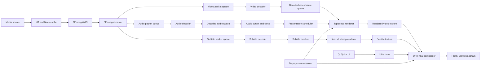

# Cross-Platform HDR Video Player Architecture Notes

## 1. Intent

This document describes a possible modular architecture for a cross-platform video player built around:

* Qt and Qt Quick for the application shell and interface.
* QRhi for final GPU composition and native display presentation.
* FFmpeg for media demuxing, decoding, stream metadata, and hardware-acceleration APIs.
* libplacebo as the common video renderer on Windows, Linux, and macOS.
* libass for ASS/SSA and text-subtitle rasterisation.
* A replaceable audio-output backend.
* A custom buffering and I/O layer designed to remain responsive around unreliable network storage.

This is an architectural information dump rather than an implementation specification. Class names, ownership boundaries, queue layouts, and platform integration methods are illustrative. The main invariant is that there is **one video colour-processing implementation: libplacebo on every platform**.

libplacebo contains the video-rendering portions derived from mpv, including colour management, scaling, HDR tone mapping, Dolby Vision processing, film grain, dithering, debanding, and deinterlacing. Its supported GPU backends are Vulkan, including MoltenVK, OpenGL, and Direct3D 11.

## 2. Overall system shape



A playback session can be viewed as three largely independent pipelines:

1. The media pipeline transforms source bytes into timestamped decoded video, audio, and subtitle data.
2. The presentation pipeline selects the correct video frame for the current clock and asks libplacebo to render it for the current display.
3. The application pipeline maintains UI state, user commands, playback state, settings, and diagnostics.

The pipelines communicate through bounded queues and immutable or reference-counted snapshots rather than through shared mutable FFmpeg contexts.

## 3. Architectural invariants

### One colour pipeline

All video colour interpretation and transformation remains in libplacebo:

```text
decoded YUV or RGB planes
→ range and bit-depth interpretation
→ chroma reconstruction
→ YUV-to-RGB conversion
→ Dolby Vision reshaping where applicable
→ transfer-function decoding
→ tone mapping
→ gamut mapping
→ scaling
→ dithering and optional processing
→ target RGB texture
```

FFmpeg provides decoded frames and associated metadata. libplacebo translates those frames into the desired output representation. The final QRhi compositor does not duplicate tone mapping, Dolby Vision processing, chroma reconstruction, or video scaling.

### Explicit colour contracts

Every texture crossing a subsystem boundary has an explicit description containing at least:

* Pixel format.
* Primaries.
* Transfer function.
* Signal range.
* Alpha convention.
* Reference-white convention.
* Nominal and maximum luminance.
* Whether values are scene-referred, display-referred, or already tone-mapped.
* Whether the texture is safe to sample concurrently.
* Native-device and synchronisation ownership.

No subsystem assumes that “RGBA16F” alone describes the meaning of its values.

### No CPU round-trip in normal playback

The intended accelerated path is:

```text
hardware decoder surface
→ GPU-native frame import
→ libplacebo GPU rendering
→ offscreen GPU texture
→ QRhi GPU composition
→ swapchain
```

Software decode and CPU upload remain valid fallbacks, but not the normal path on supported hardware.

### One graphics adapter per active presentation pipeline

The hardware decoder, libplacebo renderer, QRhi compositor, and Qt Quick renderer preferably use the same physical GPU and compatible native devices.

This avoids:

* Integrated-GPU-to-discrete-GPU frame copies.
* CPU downloads of hardware frames.
* Cross-adapter texture sharing.
* Multiple independent shader and texture pools.
* Unexpected activation of a high-power discrete GPU.

### Rendering is demand-driven

The application does not need a permanent display-refresh-rate rendering loop.

A new composition is meaningful when:

* A new video frame becomes due.
* A subtitle changes.
* The UI changes or animates.
* The window geometry changes.
* Display HDR properties change.
* A paused frame needs to be rerendered for changed settings.
* A diagnostic overlay changes.

A paused, unobscured, unchanged frame can remain static.

## 4. Suggested module boundaries

## 4.1 Application shell

The application shell owns process-level services:

* Window creation.
* Qt application lifecycle.
* Settings persistence.
* Command-line and file-association handling.
* Single-instance behaviour.
* Recent-media history.
* Logging configuration.
* Platform integration.
* Top-level playback-session creation.

It does not directly perform media I/O or decoding.

## 4.2 Playback session

A playback session represents one opened media source and acts as the coordination boundary for:

* Current media identity.
* Selected video, audio, and subtitle streams.
* Duration and seekability.
* Playback rate.
* Pause state.
* Current timeline position.
* Buffering state.
* Track metadata.
* Chapter metadata.
* Decoder lifecycle.
* User-visible errors.
* Session generation.

The session can expose an immutable `PlaybackSnapshot` to the UI. Worker threads update internal state, while the UI consumes snapshots rather than reading decoder or queue internals.

Illustrative state:

```cpp
struct PlaybackSnapshot {
    PlaybackState state;
    MediaIdentity media;
    TimelinePosition position;
    std::optional<Duration> duration;

    std::vector<TrackInfo> videoTracks;
    std::vector<TrackInfo> audioTracks;
    std::vector<TrackInfo> subtitleTracks;

    TrackId selectedVideo;
    TrackId selectedAudio;
    TrackId selectedSubtitle;

    BufferState buffering;
    VideoPresentationStats videoStats;
    AudioPresentationStats audioStats;
    std::optional<PlayerError> error;
};
```

## 4.3 Media source and I/O

The source layer presents a seekable or streaming byte source to FFmpeg.

Possible source implementations include:

* Direct local-file access.
* FFmpeg-owned protocol access.
* Custom HTTP range source.
* Custom SMB-aware source.
* Cached remote-file source.
* Helper-process source for potentially blocking mounted filesystems.

A common conceptual interface:

```cpp
class MediaByteSource {
public:
    virtual ReadResult read(std::span<std::byte> destination,
                            CancellationToken cancellation) = 0;

    virtual SeekResult seek(std::int64_t absoluteOffset,
                            CancellationToken cancellation) = 0;

    virtual std::optional<std::int64_t> size() const = 0;
    virtual SourceCapabilities capabilities() const = 0;
};
```

A custom `AVIOContext` can adapt this interface to FFmpeg. FFmpeg also exposes an interrupt callback for aborting blocking protocol operations.

The I/O layer can maintain a block cache indexed by source identity, byte offset, block length, and source revision. Cache policy is independent from FFmpeg packet queues:

```text
byte cache       protects against slow source reads and repeated seeks
packet queues    decouple demuxing from decoding
frame queues     decouple decoding from presentation
```

### Helper-process boundary

A helper process is relevant when the source is a kernel-mounted network filesystem. A userspace FFmpeg interrupt callback may not be able to interrupt every filesystem operation beneath it.

The helper process can own:

* File handles.
* Blocking reads.
* Source stat calls.
* Read-ahead.
* Byte caching.
* Retry logic.

The main process communicates through bounded shared-memory buffers or IPC messages. Killing and recreating the helper does not require destroying the window, audio backend, or playback-state model.

This boundary can remain optional. Normal local files and interruptible network protocols may use an in-process source.

## 4.4 Demuxer

The demuxer owns one `AVFormatContext` and serialises all access to it.

Responsibilities include:

* Opening and probing the source.
* Reading packets.
* Enumerating streams.
* Reading global and stream metadata.
* Maintaining chapter information.
* Detecting duration and seekability.
* Dispatching packets into per-stream bounded queues.
* Flushing and repositioning after seek.
* Reporting source stalls separately from end-of-stream.

The demuxer does not decode packets.

Packets carry a playback-generation identifier:

```cpp
struct MediaPacket {
    TrackId track;
    std::uint64_t generation;
    RationalTimeBase timeBase;
    AvPacketRef packet;
};
```

The generation changes on operations that invalidate queued work, such as seek, source reopen, or major track reconfiguration. Stale packets and frames can therefore be discarded without depending only on queue flushing.

## 4.5 Track selection

Track selection is logically separate from demuxing and decoding.

Track metadata may include:

* Codec and profile.
* Language.
* Title.
* Default, forced, commentary, descriptive-audio, and hearing-impaired flags.
* Channel layout.
* Resolution and frame rate.
* HDR transfer and primaries.
* Subtitle format.
* Attached pictures.
* Embedded font attachments.

Selection policy can combine container flags, language preferences, remembered per-series preferences, and explicit user choice.

Track changes can rebuild only the affected decode path rather than reopening the complete source where the container permits it.

## 4.6 Video decoder

The video decoder owns:

* `AVCodecContext`.
* Hardware-device and hardware-frame contexts.
* Decoder frame pool.
* Codec-specific options.
* A queue of compressed video packets.
* A queue of decoded frames.
* Decode statistics and fallback state.

FFmpeg exposes hardware-device types including D3D11VA, VAAPI, VideoToolbox, and Vulkan. Hardware decoding produces `AVFrame` objects whose storage may remain in native hardware surfaces.

An illustrative decoded-frame contract:

```cpp
struct DecodedVideoFrame {
    std::uint64_t generation;
    std::uint64_t uniqueFrameId;

    MediaTime pts;
    MediaDuration duration;

    AvFrameRef frame;
    VideoFrameStorage storage;
    VideoColourDescription colour;
    VideoGeometry geometry;

    bool keyFrame;
    bool interlaced;
    RepeatField repeat;
};
```

`VideoFrameStorage` describes how the frame can be imported:

```cpp
enum class VideoFrameStorageKind {
    SystemMemory,
    D3D11Texture,
    VulkanImage,
    DrmPrime,
    VaapiSurface,
    VideoToolboxPixelBuffer
};
```

The decoder layer need not expose platform-native handles directly to the scheduler or UI. A frame-import adapter can inspect the storage only at the renderer boundary.

### Decoder selection and fallback

The capability model distinguishes:

* Codec supported by FFmpeg.
* Codec supported by the hardware decoder.
* Output pixel format supported by the renderer importer.
* Hardware surface available on the same GPU as presentation.
* Bit depth supported.
* Profile and level supported.
* Known driver workarounds.
* Whether zero-copy is possible.

Possible outcomes include:

```text
hardware decode + zero-copy import
hardware decode + GPU copy
hardware decode + CPU transfer
software decode + GPU upload
unsupported
```

The selected path and any fallback reason belong in diagnostics.

## 4.7 Decoded frame metadata

The retained final FFmpeg `AVFrame` is the source-color truth. FFmpeg owns
decoder and codec-context propagation; libplacebo owns rendering
interpretation. SunPlayer does not normalize the same metadata into a parallel
policy model or blanket-copy stream properties after decode.

A narrow exception is appropriate only when a pinned-library propagation gap
is demonstrated by a real regression. The current exception snapshots global
HDR10+ stream side data and attaches it only when the decoded frame has no
frame-local value. Diagnostics inspect the retained frame and the mapped
libplacebo result directly and are allowed to converge on a later frame.

## 4.8 Graphics host

The graphics host represents the shared native GPU environment for one presentation domain.

Conceptually it owns:

* Native graphics instance and device.
* Selected physical adapter.
* Graphics queue or immediate context.
* QRhi instance.
* Qt Quick graphics device.
* libplacebo GPU object.
* Shader and pipeline caches.
* Shared texture pools.
* Synchronisation primitives.
* Device-loss generation.
* Backend diagnostics.

Illustrative structure:

```cpp
struct GraphicsEnvironment {
    GraphicsBackend backend;
    AdapterIdentity adapter;

    NativeGraphicsDevice native;
    QRhi* rhi;
    PlaceboGpuHandle placebo;

    GraphicsCapabilities capabilities;
    std::uint64_t deviceGeneration;
};
```

Qt Quick can adopt existing D3D11, Vulkan, Metal, or QRhi devices, and Qt documents rendering a Qt Quick scene into an application-provided `QRhiTexture`.

QRhi has a limited compatibility guarantee compared with ordinary public Qt APIs, so the Qt integration can remain behind a narrow internal wrapper rather than leaking QRhi types across the player core.

## 4.9 libplacebo video renderer

The libplacebo renderer owns:

* `pl_log`.
* One backend-specific `pl_gpu`.
* One `pl_renderer`.
* Mapped or wrapped input textures.
* Offscreen target textures.
* Render-parameter presets.
* Renderer cache lifecycle.
* Per-frame mapping state.
* GPU timing and render diagnostics.

The `pl_renderer` is persistent. Source frame, target frame, dimensions, colour spaces, metadata, and render parameters are supplied for each render operation. `pl_render_image()` is explicitly dynamic: size, colour space, and parameters may change, and libplacebo invalidates affected caches internally. Input planes must be sampleable and target planes renderable, which permits rendering directly into ordinary offscreen textures.

The renderer API is documented as thread-unsafe, so a render-thread-confined `pl_renderer` or another serialised ownership model is appropriate.

Illustrative request:

```cpp
struct VideoRenderRequest {
    DecodedVideoFrame frame;
    DisplayState display;
    VideoViewport viewport;
    RenderQualityProfile quality;
    VideoAdjustmentState adjustments;
};

struct RenderedVideoSurface {
    SharedGpuTexture texture;
    RenderSurfaceDescription description;
    MediaTime sourcePts;
    std::uint64_t sourceFrameId;
    std::uint64_t displayRevision;
};
```

### Render parameters

The public player settings need not mirror libplacebo’s full option surface.

Most libplacebo options can remain internal and neutral. The renderer provides fast, default, and high-quality configurations; its documented default preset is intended to be reasonable on integrated GPUs, while the high-quality preset enables more expensive processing.

A player-facing configuration may contain only:

* Quality or energy profile.
* SDR/reference-white brightness.
* Display peak override.
* HDR exposure adjustment.
* Tone-mapping preference.
* Highlight-versus-brightness preference.
* Optional debanding.
* Optional film-grain synthesis.
* Optional interpolation.
* Debug clipping visualisation.

Saturation, hue, distortion, custom shaders, and specialist colour adjustments can remain unexposed.

### FFmpeg mapping

libplacebo provides high-level FFmpeg helpers such as `pl_map_avframe_ex()`. The helper maps supported `AVFrame` representations, retains the FFmpeg frame as needed, and maps Dolby Vision metadata by default in current headers.

A separate input-import abstraction remains useful because not every platform-native hardware-frame representation necessarily passes through the same helper path:

```cpp
class PlaceboFrameImporter {
public:
    virtual ImportedPlaceboFrame import(
        const DecodedVideoFrame& frame,
        GraphicsEnvironment& graphics
    ) = 0;
};
```

Possible implementations conceptually include:

* Software-frame upload importer.
* D3D11 texture-plane importer.
* Vulkan-frame importer.
* DRM PRIME/dma-buf importer.
* VideoToolbox/IOSurface/MoltenVK importer.

The importer owns the lifetime and synchronisation relationship between the `AVFrame`, decoder surface, and libplacebo textures.

## 4.10 Offscreen render target

The simple composition architecture renders libplacebo into an offscreen GPU texture.

A likely target format is floating-point RGBA, commonly RGBA16F. Its semantic description remains explicit:

```cpp
struct RenderSurfaceDescription {
    PixelFormat format;
    ColourPrimaries primaries;
    TransferFunction transfer;
    AlphaMode alpha;
    LuminanceScale luminance;
    bool displayReferred;
};
```

Several working-space choices remain possible:

* Linear extended sRGB/scRGB-like values.
* Linear BT.2020.
* Linear Display P3.
* Current display-native linear primaries.

The critical property is not a universal choice of gamut. It is that libplacebo and the QRhi compositor agree exactly about:

* What numerical value represents reference white.
* What numerical values represent HDR highlights.
* Whether tone mapping has already occurred.
* Which primaries the channels represent.
* Whether the surface changes when the window changes display.

A display-target-linear surface simplifies subtitle and UI composition because all layers can be expressed relative to the same display luminance model.

## 4.11 Final QRhi compositor

The final compositor combines:

* Rendered video.
* Text or bitmap subtitles.
* Qt Quick output.
* Optional debugging and playback overlays.
* Background or letterbox colour.

Its responsibilities are intentionally narrower than libplacebo’s:

* Layer geometry.
* Alpha composition.
* Conversion from the chosen intermediate luminance convention to the platform swapchain convention.
* Optional clipping to the actual display output range.
* Swapchain presentation.
* Damage and redraw tracking.

It does not reinterpret source-video colour metadata.

Possible pass shape:

```text
libplacebo video target
        +
subtitle target
        +
Qt Quick target
        +
overlay state
        ↓
one fullscreen QRhi composition pass
        ↓
HDR/EDR swapchain
```

Qt documents external native texture wrapping through `QRhiTexture::createFrom()`, provided the texture belongs to the same device or compatible sharing context.

Qt’s HDR swapchain options include extended linear sRGB/scRGB and HDR10; Qt describes extended linear sRGB as the recommended desktop HDR swapchain format, with conversion to the display’s native colour space performed by the windowing system.

## 4.12 Qt Quick UI rendering

Two broad Qt Quick integration shapes fit this architecture.

### Qt Quick rendered offscreen

`QQuickRenderControl` renders the interface into a `QRhiTexture`. The final compositor samples that texture together with video and subtitles.

Advantages:

* Complete ownership of final composition.
* Explicit UI luminance mapping.
* Clear separation between Qt Quick and presentation.
* Potential reuse for screenshots or transitions.

Costs:

* An additional UI render target.
* Explicit animation advancement.
* Explicit synchronisation with the final compositor.

Qt provides an example specifically demonstrating redirection of a Qt Quick scene into a QRhi texture.

### Video rendered under the Qt Quick scene

The custom video rendering and final video pass are injected before Qt Quick’s own scene-graph rendering.

Advantages:

* Potentially fewer full-screen intermediate operations.
* Native Qt Quick scene-graph composition.

Costs:

* More coupling to Qt Quick’s render loop.
* Less explicit control over UI HDR luminance.
* Harder separation of presentation and UI lifecycle.
* More care around Qt’s render-thread ownership.

The architecture can hide this choice behind the compositor boundary.

## 4.13 Display-state observer

libplacebo does not discover operating-system display state. The application supplies the current target colour and luminance information.

A display snapshot may contain:

```cpp
struct DisplayState {
    std::uint64_t revision;

    DisplayIdentity display;
    bool hdrPresentationAvailable;
    bool hdrPresentationEnabled;

    ColourPrimaries outputPrimaries;
    TransferFunction outputTransfer;

    std::optional<float> minimumNits;
    std::optional<float> maximumNits;
    std::optional<float> maximumFullFrameNits;
    std::optional<float> sdrWhiteNits;

    float effectiveTargetPeakNits;
    float effectiveReferenceWhiteNits;

    DisplayStateConfidence confidence;
};
```

Changes that can increment `revision` include:

* Window moving to another display.
* HDR being enabled or disabled.
* Display mode changing.
* SDR/reference-white level changing.
* Apple EDR headroom changing.
* Display brightness or power state changing.
* Docking or undocking.
* Monitor hotplug.
* Swapchain recreation.
* User overrides changing.

A changed revision invalidates rendered video surfaces whose tone mapping depended on the old state. This includes paused video: the same decoded frame can be submitted to libplacebo again with the new target description.

Qt exposes HDR-related information associated with a swapchain’s output, including values useful for display-target tone mapping.

The display layer can also distinguish:

```text
reported physical capability
current operating-system presentation mode
estimated usable headroom
user-selected effective target
```

The effective target passed to libplacebo need not blindly trust a single OS value.

## 5. Platform graphics variants within the one-renderer architecture

## 5.1 Windows

Conceptual path:

```text
D3D11 device
├── Qt Quick / QRhi D3D11
├── FFmpeg D3D11VA
└── libplacebo D3D11
```

libplacebo can wrap an existing `ID3D11Device`, allowing it to share the application’s device instead of creating another one.

A decoded D3D11 frame typically represents one or more texture planes or array slices. The importer maps the correct resource, subresource, and plane interpretation into libplacebo textures.

The offscreen result can be an `ID3D11Texture2D` wrapped by both libplacebo and QRhi.

Relevant synchronisation considerations include:

* Immediate-context serialisation.
* Decoder-surface lifetime.
* Texture-array slice identity.
* Whether a copy is needed for shader-resource compatibility.
* Driver-specific direct-sampling behaviour.
* Device removal and recreation.

## 5.2 Linux

Conceptual paths include:

```text
VAAPI
→ DRM PRIME / dma-buf
→ Vulkan image
→ libplacebo Vulkan
```

or:

```text
FFmpeg Vulkan hardware frame
→ libplacebo Vulkan
```

The graphics environment can expose one Vulkan instance, physical device, logical device, and queue configuration to QRhi and libplacebo.

libplacebo provides an explicit Vulkan device-import API, but its documentation warns that shared-device interoperation requires careful communication of Vulkan state.

QRhi can adopt an existing Vulkan device, and Qt also exposes Vulkan semaphore wait/signal integration for advanced external rendering.

The handoff needs explicit tracking of:

* Image layout.
* Queue-family ownership.
* Semaphore or fence state.
* Read/write access.
* Image lifetime.
* Whether libplacebo and QRhi submit on the same queue.
* External-memory ownership for dma-buf-backed images.

## 5.3 macOS

libplacebo has no native Metal backend. The common renderer therefore operates through Vulkan on MoltenVK. MoltenVK implements Vulkan over Metal and uses Metal surfaces for presentation.

Two integration shapes remain possible without creating a second video renderer.

### Shared MoltenVK/Vulkan graphics stack

```text
VideoToolbox CVPixelBuffer / IOSurface
→ Vulkan/MoltenVK import
→ libplacebo Vulkan
→ QRhi Vulkan
→ MoltenVK-backed presentation
```

This minimises cross-API synchronisation because Qt Quick, QRhi, and libplacebo share Vulkan objects.

Open technical questions include:

* Efficient import of multi-plane VideoToolbox surfaces.
* Whether the required IOSurface formats map cleanly.
* EDR-capable surface and colour-space configuration.
* Qt Quick energy behaviour through MoltenVK.
* Resource transitions around VideoToolbox-owned surfaces.
* Whether any hidden copy occurs.

### libplacebo on MoltenVK with QRhi Metal composition

```text
VideoToolbox CVPixelBuffer / IOSurface
→ libplacebo Vulkan/MoltenVK
→ IOSurface-backed rendered texture
→ matching MTLTexture
→ QRhi Metal compositor
→ native Metal EDR presentation
```

This retains Qt’s native Metal renderer while keeping libplacebo as the sole video renderer.

Additional concerns include:

* Cross-API texture sharing.
* Synchronisation between Vulkan semaphores and Metal events.
* IOSurface pixel-format compatibility.
* Ownership transitions.
* Avoiding a hidden GPU copy.
* Ensuring the two APIs use the same physical GPU.

FFmpeg’s VideoToolbox hardware context works with Core Video pixel buffers and pixel-buffer pools.

The macOS importer and interop layer is the largest unresolved technical area in this architecture. It is an integration risk, not a reason to duplicate the video colour pipeline.

## 6. Subtitle system

The subtitle system separates decoding, timeline management, layout, and rasterisation.

### Subtitle categories

* ASS/SSA text and authored effects.
* Plain text such as SRT or WebVTT.
* Bitmap formats such as PGS and VobSub.
* Forced-only subtitle subsets.
* Container attachments such as fonts.

libass is a portable ASS/SSA subtitle renderer and aims for VSFilter compatibility.

### Coordinate spaces

The subtitle model can preserve distinct coordinate spaces:

```text
window rectangle
video presentation rectangle
uncropped source-video rectangle
authored ASS canvas
dialogue safe rectangle
control-overlay avoidance rectangle
```

Authored ASS positioning and user-adjusted dialogue positioning are separate concepts.

For example:

* Positioned signs continue to use authored ASS coordinates.
* Ordinary dialogue can optionally move into or out of letterbox bars.
* User subtitle scale can affect dialogue without necessarily distorting authored signs.
* Bitmap subtitles remain attached to source-video coordinates.
* UI visibility can temporarily alter the dialogue safe region.

### Subtitle output

The subtitle renderer can produce:

* An RGBA texture.
* An alpha mask plus colour/luminance metadata.
* A list of subtitle image quads.

The subtitle layer is composed after video tone mapping in display-linear space. Subtitle white can therefore have an explicit luminance target rather than inheriting arbitrary swapchain values.

Illustrative state:

```cpp
struct SubtitlePresentationStyle {
    SubtitlePlacementMode placement;
    float dialogueScale;
    float dialogueVerticalOffset;
    float subtitleWhiteNits;
    float outlineLuminance;
    bool avoidControls;
    bool respectAuthoredPositioning;
};
```

## 7. Audio pipeline

The audio pipeline includes:

```text
compressed packets
→ FFmpeg audio decoder
→ format/channel conversion
→ optional time stretching
→ bounded PCM queue
→ audio-device callback
```

Possible output libraries include:

* cubeb.
* miniaudio.
* Qt Audio.
* A small native backend abstraction.

cubeb offers cross-platform audio output, latency-compensated position reporting, and both low-latency and more power-efficient higher-latency modes.

miniaudio offers a small cross-platform callback-based API with direct control over device format and buffering.

The audio callback performs only real-time-safe operations:

* Read from a lock-free or callback-safe PCM ring.
* Apply trivial gain.
* Write silence on underrun.
* Update atomic position counters.

It does not decode, allocate, log synchronously, seek, or call into Qt.

## 8. Clock and A/V synchronisation

For normal playback, the rendered audio position is a useful master clock.

The clock model may combine:

* Number of submitted audio frames.
* Device-reported latency.
* Number of frames currently queued.
* Monotonic host time.
* Playback-rate transformation.
* Pause and seek anchors.

Illustrative clock:

```cpp
struct MediaClockSnapshot {
    MediaTime mediaPosition;
    MonotonicTime sampledAt;
    double playbackRate;
    bool advancing;
    ClockConfidence confidence;
};
```

The video scheduler compares frame PTS against the predicted audio clock at presentation.

Conceptual outcomes:

```text
frame too early     retain until nearer presentation
frame on time       render/present
frame slightly late present immediately
frame very late     drop
frame generation old discard
```

Large discontinuities trigger clock resynchronisation rather than gradual correction.

Audio-only and muted modes may use a monotonic-clock master. External-audio-device changes can temporarily switch the clock into a recovering state.

## 9. Queueing and backpressure

All queues are bounded.

Useful limits include both:

* Memory or byte count.
* Media-time duration.

Different queues have different purposes:

| Queue                    | Typical concern                         |
| ------------------------ | --------------------------------------- |
| Source blocks            | Network jitter and repeated reads       |
| Compressed video packets | Demux/decode decoupling                 |
| Compressed audio packets | Audio continuity                        |
| Decoded video frames     | Decoder reordering and renderer latency |
| Decoded audio            | Audio callback safety                   |
| Subtitle events          | Timeline lookahead                      |

Backpressure propagates upstream. A full decoded-video queue can stop video decoding without stopping audio demuxing. A stalled audio queue may receive higher priority than additional video lookahead.

Queue state contributes to a unified buffering model:

```cpp
struct BufferState {
    MediaDuration sourceReadAhead;
    MediaDuration videoPacketAhead;
    MediaDuration decodedVideoAhead;
    MediaDuration audioPacketAhead;
    MediaDuration decodedAudioAhead;

    bool sourceStalled;
    bool demuxEndOfStream;
    bool videoStarved;
    bool audioStarved;
};
```

“Buffering” is not inferred from one queue alone.

## 10. Seeking

A seek changes the session generation.

Conceptual flow:

```text
seek request
→ suspend normal packet dispatch
→ increment generation
→ clear or invalidate packet/frame queues
→ flush decoders
→ demuxer seek
→ decode from the nearest usable point
→ identify first presentable video and audio timestamps
→ re-anchor clock
→ resume presentation
```

Several seek modes can coexist:

* Exact seek.
* Fast keyframe seek.
* Scrub seek.
* Frame step.
* Chapter seek.
* Live-stream relative seek.

The generation identifier prevents frames from an older seek from leaking into the new timeline even when asynchronous work completes late.

## 11. Playback state model

Possible states include:

```text
Closed
Opening
Ready
Playing
Paused
Seeking
Buffering
EndOfStream
RecoveringSource
RecoveringAudio
RecoveringGraphics
Failed
```

State is orthogonal to certain flags:

* User intends playback.
* Source is currently stalled.
* Audio device is unavailable.
* Video output is temporarily unavailable.
* The window is hidden.
* Playback has reached logical end-of-stream.

This avoids conflating “paused by the user” with “temporarily unable to advance.”

## 12. Display changes and rerendering

Each rendered video surface records:

* Source frame identity.
* Source metadata identity.
* Render settings revision.
* Display-state revision.
* Output size.
* Crop and transform.
* libplacebo render-profile revision.

The cached rendered surface is reusable only while those values remain compatible.

Examples:

```text
subtitle moved
    video texture reusable
    subtitle/compositor redraw only

UI changed
    video texture reusable
    final composition redraw only

display peak changed
    video texture invalid
    same decoded frame rerendered through libplacebo

window resized
    video rerender may be desirable for scaling quality

swapchain encoding changed
    video may or may not need rerendering depending on intermediate contract

HDR disabled
    target colour space changes
    video rerendered
```

A display change does not require recreating `pl_renderer`; libplacebo accepts target and parameter changes per render call and manages invalidated internal resources.

`pl_renderer_flush_cache()` is more relevant to major content discontinuities, such as switching files, or explicitly resetting temporal state such as peak detection. Ordinary target changes do not require it.

## 13. Power and performance model

Power efficiency depends more on data movement and scheduling than on whether a library exposes many optional effects.

### High-impact properties

* Hardware decode where compatible.
* Same adapter for decode and render.
* No CPU frame transfer.
* No unnecessary GPU-to-GPU copy.
* No render loop while paused.
* No frame interpolation by default.
* No expensive scaling when source and destination dimensions are close.
* No debanding by default.
* Metadata-driven HDR rendering where sufficient.
* Dynamic histogram analysis only where it improves output.
* UI animation suspended when hidden.
* Reasonable swapchain and decode queue depth.
* Video rendering at source cadence rather than blindly at display cadence.
* Batch or defer non-visible metadata and thumbnail work.
* Prefer integrated GPU on hybrid systems unless capabilities require otherwise.

### Quality profiles

An internal quality model may resemble:

```cpp
enum class RenderQualityProfile {
    EnergySaving,
    Balanced,
    HighQuality
};
```

These profiles select groups of libplacebo parameters rather than exposing every low-level option.

A profile may influence:

* Scaling kernel.
* Chroma reconstruction.
* Debanding.
* Film grain.
* Peak detection.
* Gamut-map LUT quality.
* Intermediate texture precision.
* Frame interpolation.
* Queue depth.
* Decoder choice.

### Instrumentation

Useful metrics include:

* Demux read latency.
* Cache hit rate.
* Packet queue duration.
* Decode time.
* Decoder surface count.
* Hardware-to-renderer copy count.
* libplacebo pass count.
* Per-pass GPU time.
* Final compositor GPU time.
* Dropped and repeated frames.
* Audio underruns.
* Wakeups per second.
* Rendered frames per decoded frame.
* Adapter identity.
* Estimated power mode.
* Hidden software fallback.

libplacebo supports an informational callback for executed render passes, which can contribute to renderer diagnostics.

## 14. Error and recovery domains

Errors can be classified by subsystem rather than collapsed into “playback failed.”

### Source errors

* File disappeared.
* Network disconnected.
* Read timeout.
* Helper process stopped responding.
* Authentication failure.
* Source contents changed.

### Demux errors

* Unsupported or malformed container.
* Probe failure.
* Timestamp discontinuity.
* Seek unsupported.

### Decode errors

* Unsupported profile.
* Hardware decoder rejected stream.
* Surface allocation failed.
* Corrupt packet.
* Driver reset.
* Software fallback required.

### Render errors

* Native texture import failed.
* libplacebo pass failed.
* Output texture allocation failed.
* Unsupported colour transformation.
* Synchronisation failure.
* Device loss.

### Presentation errors

* Swapchain recreation.
* HDR output unavailable.
* Display removed.
* Window changed adapter.
* Incompatible interop path.

### Audio errors

* Device removed.
* Format unsupported.
* Callback underrun.
* Device restart required.

Recovery can preserve as much session state as possible:

```text
source recovery      retains selected tracks and target position
decoder recovery     recreates decoder and resumes near current position
graphics recovery    rebuilds GPU resources while audio/session survive
audio recovery       temporarily uses another clock source
display recovery     falls back to SDR presentation
```

## 15. Capability reporting

A structured capability model makes fallback behaviour observable.

```cpp
struct VideoPipelineCapabilities {
    std::vector<CodecCapability> codecs;
    std::vector<HardwareDecodePath> decodePaths;
    std::vector<FrameImportPath> importPaths;
    std::vector<OutputMode> outputModes;

    bool zeroCopyPossible;
    bool dolbyVisionMetadataSupported;
    bool hdr10PlusMetadataSupported;
    bool dynamicPeakDetectionSupported;
    bool filmGrainSynthesisSupported;
};
```

The diagnostics view may report the selected pipeline in human-readable form:

```text
Decoder: VideoToolbox HEVC Main 10
Decoder surface: P010 CVPixelBuffer
Importer: IOSurface → MoltenVK
Video renderer: libplacebo Vulkan
Intermediate: RGBA16F linear Display P3
Compositor: QRhi Metal
Output: EDR extended linear Display P3
Copies: 0 CPU, 0 known GPU
```

This is especially useful for determining why one device consumes substantially more power than another.

## 16. Thumbnail and preview rendering

Thumbnail generation can share FFmpeg and libplacebo concepts without sharing the live renderer object.

Possible separation:

* Independent low-priority demux/decode context.
* Independent software or hardware decoder.
* Independent libplacebo renderer.
* Small SDR output targets.
* Aggressive cache.
* Cancellation on user interaction ending.
* No interference with live decode surface pools.

Thumbnail output is normally display-referred SDR, even when the source is HDR.

## 17. Screenshots and frame export

Screenshot behaviour can distinguish:

* Raw decoded frame export.
* Source-referred processed export.
* Display-referred image matching current playback.
* Screenshot including subtitles.
* Screenshot including complete UI.

A display-matching screenshot can read back the composed offscreen target before platform-specific presentation conversion. GPU readback is acceptable for explicit screenshots but absent from normal playback.

## 18. Testing model

### Pure unit tests

* Rational timestamp conversion.
* Clock anchoring.
* Queue backpressure.
* Seek-generation invalidation.
* Track-selection policy.
* Colour-metadata precedence.
* Subtitle rectangle calculation.
* Display revision invalidation.
* State-machine transitions.
* Cache indexing and invalidation.

### Renderer image tests

* SDR BT.601 and BT.709.
* Full- and limited-range input.
* 8-, 10-, and 12-bit input.
* Chroma-location patterns.
* HDR10 static metadata.
* HDR10+ scene changes.
* HLG.
* Dolby Vision profiles supported by the dependency build.
* Gamut-boundary patterns.
* Display-target peak changes.
* SDR output from HDR input.
* HDR output from SDR input where enabled.
* Subtitle luminance and alpha edges.

Image tests can render to offscreen targets and perform CPU readback only in the test process.

### Integration tests

* Hardware decode into libplacebo.
* Zero-copy frame import.
* Seek under decoder load.
* Display hotplug.
* HDR mode toggle.
* Audio-device replacement.
* Network source stall.
* Helper-process termination.
* Graphics device loss.
* Window movement between displays.
* Pause followed by display-state change.

### Performance and power tests

Representative cases include:

* 1080p24 SDR.
* 4K24 HDR10 HEVC.
* 4K60 HDR10.
* 4K Dolby Vision where supported.
* 8K software fallback.
* Heavy ASS subtitles.
* Network playback with intermittent stalls.
* Paused playback.
* Hidden or minimised window.
* Integrated versus discrete GPU.

Relevant output includes frame time, copies, wakeups, decoder utilisation, GPU utilisation, and platform energy measurements.

## 19. Dependency and build boundaries

Potential dependency groups:

```text
Core
    Qt Core
    FFmpeg libavformat/libavcodec/libavutil/libswresample

Rendering
    Qt Gui / QRhi
    Qt Quick
    libplacebo
    Vulkan loader and MoltenVK where relevant

Subtitles
    libass
    FreeType / HarfBuzz / Fontconfig as required by platform build

Audio
    cubeb, miniaudio, Qt Audio, or native adapters

Optional
    SQLite
    ICU
    libbluray
    crash reporting
```

libplacebo is built with Meson and exposes optional build features such as Vulkan, D3D11, shader compilation, colour management, and Dolby Vision support.

Dependency discovery can expose compiled capabilities at runtime rather than assuming every packaged build contains every optional feature.

## 20. Illustrative source-tree decomposition

```text
src/
    app/
        application lifecycle
        settings
        commands
        file associations

    core/
        clocks
        cancellation
        queues
        immutable snapshots
        errors
        diagnostics

    media/
        source abstraction
        cache
        helper-process protocol
        ffmpeg AVIO adapter
        demuxer
        track metadata

    decode/
        video decoder
        audio decoder
        subtitle decoder
        hardware capability discovery

    video/
        decoded-frame model
        source and mapping diagnostics
        frame importers
        libplacebo renderer
        render settings

    audio/
        audio pipeline
        resampling
        audio sink abstraction
        device handling
        master clock

    subtitles/
        subtitle timeline
        libass integration
        bitmap subtitle rendering
        subtitle geometry

    graphics/
        graphics environment
        QRhi wrapper
        final compositor
        texture lifetime
        synchronisation
        display state

    platform/
        windows/
        linux/
        macos/

    playback/
        session
        scheduler
        state machine
        seek controller
        buffering model

    ui/
        QML
        UI-facing models
        input handling

    diagnostics/
        pipeline report
        timing telemetry
        debug overlays

tests/
    unit/
    renderer/
    integration/
    performance/
```

Platform directories contain native-device and display integration, not separate video-colour algorithms.

## 21. Important open technical questions

The architecture has several questions whose answers materially affect the implementation but not the overall module model.

### macOS zero-copy viability

* Can a VideoToolbox P010 `CVPixelBuffer` be sampled by libplacebo through MoltenVK without an intermediate copy?
* Can libplacebo render to an IOSurface-backed texture that QRhi Metal samples directly?
* What synchronisation mechanism is reliable between MoltenVK and QRhi Metal?
* Does the shared Vulkan-only Qt path provide correct EDR presentation?
* What is the energy cost relative to a native VideoToolbox/Metal pipeline?
* Does MoltenVK introduce hidden texture conversions for multi-plane formats?

### Canonical intermediate colour space

* Linear extended sRGB, BT.2020, Display P3, or display-native primaries.
* Fixed absolute reference white versus display-relative values.
* Whether libplacebo’s output is already fully display-targeted.
* Whether UI and subtitles use absolute nits or a reference-white-relative scale.
* Whether an SDR-display transition always rerenders the video texture.

### Qt integration shape

* Qt Quick rendered into an offscreen texture.
* Video injected underneath Qt Quick.
* One application-owned QRhi adopted by Qt Quick.
* Qt-owned QRhi with native objects queried and adopted by libplacebo.
* One QRhi per window versus a shared graphics environment.

### Network-storage isolation

* In-process custom AVIO only.
* Helper process only for configured network paths.
* Helper process for all media.
* Shared-memory versus pipe-based data transfer.
* Persistence and size of the block cache.
* Behaviour when the source changes while open.

### Audio backend

* cubeb’s latency-aware clocking and mature platform backends.
* miniaudio’s small integration surface.
* Qt Audio’s dependency simplicity.
* Native audio implementations where platform behaviour matters.

### Multi-window behaviour

* One active playback window.
* Several windows sharing one graphics device.
* Picture-in-picture.
* Video mirrors on different displays with different HDR targets.
* Separate libplacebo render result per display target.
* Whether one decoded frame can feed several target renders.

## 22. Core mental model

The intended division of responsibility is:

```text
FFmpeg
    understands containers, codecs, timestamps, decoded frames,
    hardware devices, and source metadata

libplacebo
    understands how the decoded image and HDR metadata become
    a correctly rendered image for a declared target

QRhi
    understands how the rendered video, subtitles, and Qt UI
    become a platform-native swapchain image

the playback core
    understands time, state, buffering, seeking, policy,
    cancellation, and recovery

platform adapters
    understand native displays, graphics devices, decoder surfaces,
    and operating-system lifecycle events
```

The main architectural difficulty is not ordinary decoding or tone mapping. It is maintaining a zero-copy, correctly synchronised texture path through the platform decoder, libplacebo, QRhi, and the final HDR presentation system—especially on macOS—without allowing those platform details to leak into playback state, subtitle logic, or media I/O.
