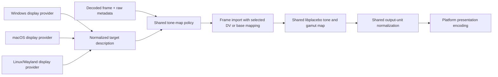

# Metadata-first HDR presentation mapping

> Status: research and implementation record, 2026-08-21 through 2026-08-22.
> The initial shared policy is accepted in
> [ADR 0023](../decisions/0023-use-metadata-first-hdr-to-sdr-policy.md) and
> ADR 0024's normal-HDR absolute-target construction was subsequently rejected
> by [ADR 0025](../decisions/0025-keep-normal-hdr-reference-white-adaptive.md)
> after it was shown to cancel Windows's live SDR-white scale. ADR 0025 retains
> the nominal-100 HDR-to-SDR result and the source-side metadata improvements.
> Exact-frame physical comparison
> remains follow-up evidence for perceptual claims, not an unreported
> implementation assumption.

## Executive conclusion

The reported dark HDR-to-SDR output, together with the inspected metadata and
pinned source, supports the hypothesis that SunPlayer needs an explicit
content/metadata policy around its general-purpose tone mapper. It does not show
that libplacebo is incapable of tone mapping HDR, and the available screenshots
are not measurement evidence.

Before this change, the renderer always selected libplacebo 7.360.1's generic `spline`
operator with metadata selection set to `ANY`. That operator adapts its knee
from a selected source maximum and average, but it does not consume an HDR10+
Bezier OOTF and it cannot consume Dolby Vision Level 2 or Level 8 artistic
trims. If PQ content has no usable luminance metadata, pinned libplacebo uses
PQ's nominal 10,000-nit code range. Compressing that range into an SDR target
can substantially lower ordinary midtones. That is deterministic and
loss-averse, but it is a poor playback fallback for typical metadata-less
1,000-nit material.

There is no single switch that recovers every authored SDR appearance:

* A licensed Dolby display-management path is required to claim application of
  Dolby Vision L2/L8 target trims.
* Libplacebo's `st2094-40` operator is the available target-aware path for an
  HDR10+ Bezier OOTF, when one is actually present.
* Libplacebo's BT.2446A-derived EETF is an available standards-traceable generic
  HDR-to-SDR candidate in the pinned library, but it remains a defined
  trade-off, not a complete Method A implementation, authored trim, or universal
  ground truth.
* Metadata-less PQ is under-specified. The accepted 1,000-nit fallback is a
  practical, deterministic compatibility assumption, not source metadata. It
  is narrow, visible in diagnostics, and covered by policy/curve/render tests;
  later physical comparison can refine it without disguising its provenance.

The first implementation also exposed a second, independent issue. SunPlayer
used libplacebo's fixed `1.0 = 203 nits` output normalization as though it were
the physical destination. A valid HDR10+ curve could therefore leave an 80-nit
scene at roughly `80 / 203` on a nominal SDR surface instead of mapping against
a real 100-nit destination. On HDR, source pixels and metadata remained in
physical cd/m² while the virtual destination changed with desktop reference
white. This was a unit-model error, not evidence for a brightness curve.

The accepted construction gives libplacebo a nominal 100-nit target for
headroom-one PQ and an authoritative physical display peak for automatic
scene-referred HDR PQ. After tone and gamut mapping it uniformly converts
libplacebo's `outputNits / 203` coordinates into SunPlayer's
`outputNits / targetWhite` surface coordinates. Valid HDR10+ OOTFs on the
selected non-Dolby or HDR10-compatible base therefore use ST 2094-40 against
the real target on SDR and on eligible HDR targets. The exploratory `1/1.15`
and `1/1.08` post-curves are rejected.

The resulting policy belongs in the shared video-rendering layer. Platform
providers report normalized target facts; Windows, macOS, and Linux presentation
code must not independently choose content tone curves.

The implemented slice remains small: one shared policy decision selects a
coherent metadata family, tone function, and whether target luminance is
absolute; peak detection stays disabled, existing diagnostics expose the
decision, and tests cover the matrix. Do not add a user setting, arbitrary
exposure, custom Dolby mapper, ABL model, or second rendering path.

## Question and constraints

The immediate question is:

> How should SunPlayer map PQ/HDR10, HDR10+, and supported Dolby Vision inputs
> to SDR/WCG and HDR targets so ordinary lowlights and midtones remain
> watchable, while using real source metadata whenever possible and avoiding
> silent image analysis?

The recommendation assumes:

* SunPlayer remains on pinned libplacebo 7.360.1 and the existing single
  FFmpeg/libplacebo render path for the first change.
* FFmpeg-decoded frame metadata remains authoritative.
* Peak detection stays disabled.
* Libplacebo continues to own transfer decoding, content tone mapping, and gamut
  mapping. SunPlayer selects policy and only converts the final linear output
  coordinate unit after an absolute-luminance map.
* The existing display-relative working representation remains intact:
  working `1.0` is active reference white and target headroom describes the
  range above it.
* Windows is the first physical acceptance platform, but the content policy
  must compile and behave identically on macOS and Linux once their target
  facts are populated.

## What “correct” can mean

HDR-to-SDR is a lossy conversion. Standards and metadata can specify a method
or creative guidance, but they do not define one universal pixel-exact result
for every source, display, and viewing environment.

For SunPlayer, correctness should mean the following, in order:

1. Apply a coherent source-provided target transform when the current
   implementation can actually represent it.
2. Otherwise use real scene or mastering metadata to guide a declared,
   target-aware standards transform.
3. Otherwise evaluate a narrow, documented format fallback that prioritizes
   usable program appearance, and report that it was assumed if accepted.
4. Preserve technical invariants: monotonic luminance, neutral grays, bounded
   output, target gamut containment, stable metadata across seeks/cuts, and no
   second OS or application tone mapper.

An official SDR release is valuable evidence of creative intent, especially
for faces, lowlights, and midtone placement. It may be a separate grade or
encode, so it is not pixel ground truth. Windows Player is a valuable production
benchmark, but its Media Foundation, driver, and optional licensed-codec policy
is not publicly specified, so it is not a normative oracle either.

## Pre-change SunPlayer behavior

The retained decoded frame is mapped into libplacebo by the software or native
GPU importer. For supported residual-free Dolby Vision input, the importer maps
the Dolby representation and reshape metadata. HDR10+ data can coexist on the
same mapped frame.

`LibplaceboRenderContext` then:

* infers missing source color-space fields;
* constructs the display-relative target from reference white, headroom,
  minimum luminance, and physical target primaries;
* copies `pl_color_map_default_params`;
* explicitly selects `pl_tone_map_spline` and perceptual gamut mapping;
* leaves metadata selection at `PL_HDR_METADATA_ANY`;
* disables inverse mapping, peak detection, contrast recovery, and dithering.

Pinned libplacebo's `ANY` metadata selection is not neutral in a frame carrying
multiple dynamic-metadata families. It starts from static HDR10 min/max, then
uses complete HDR10+ scene max/average, then replaces those values with complete
CIE-Y max/average. Dolby Vision L1 is mapped into CIE-Y, so it wins over HDR10+
scene statistics for the pre-change spline. The spline uses the selected maximum
and average to place its knee; it never reads the HDR10+ OOTF.

When no usable luminance metadata exists, source inference uses the transfer's
nominal peak. PQ can encode 10,000 nits, so metadata-less PQ was treated
as 10,000-nit input. This is a likely direct cause of severe HDR-to-SDR midtone
compression in otherwise ordinary material.

## Field evidence

### Metadata-rich hybrid sample

A user-supplied, local 2160p sample was inspected near 1:57:42. File names and
network locations are intentionally omitted from the repository. The decoded
video was PQ/BT.2020 Dolby Vision Profile 8.1 with an HDR10-compatible base
layer, RPU present, residual disabled, and no enhancement layer. The same frame
also carried:

* a 1,000-nit mastering maximum and 0.005-nit mastering minimum;
* MaxCLL 1,230 nits and MaxFALL 419 nits;
* HDR10+ metadata targeting 500 nits;
* scene MaxSCL values of roughly 598, 593, and 626 nits;
* scene average MaxRGB of roughly 7 nits;
* Dolby source/mastering maximum near 1,000 nits.

This is a low-average scene with rich real metadata, not a metadata-missing
case. A generic spline can plausibly contribute to the observed difference from
the SDR reference because it makes its own detail-preservation trade-off. The
available evidence does not establish whether that SDR release came from a
Dolby trim or a separately authored grade, nor which transform caused the
difference.

The inspected RPU had identity reshape curves at that frame, so Dolby reshaping
itself was not the likely brightness difference. Ordinary `ffprobe` output does
not enumerate Dolby RPU extension blocks, so this inspection cannot establish
whether L2/L8 trims exist in the file. Even if they do, the pinned libplacebo
path does not consume them.

### Exact-frame follow-up at 14:13

A later production-path capture of another scene in the same local hybrid
sample used the exact decoded frame near 14:13. The selected HDR10+ metadata
described a target near 500 nits, scene maximum around 80 to 82 nits, and scene
average around 8.10 nits. SunPlayer correctly selected ST 2094-40 and the
HDR10-compatible base representation. Because the scene range fitted below the
virtual 203-nit destination, pinned libplacebo performed little range
compression and stored an 80-nit value near `80 / 203`. That exposed the
mistake: the same number was then interpreted as relative SDR even though the
intended destination was nominal 100-nit SDR.

The production linear-surface capture still placed the HDR rendition below the
nearby official SDR rendition. Representative luminance quantiles were:

| Rendition | p50 | p75 | p90 | p95 | p99 | maximum |
| --- | ---: | ---: | ---: | ---: | ---: | ---: |
| Initial metadata-first HDR-to-SDR | 0.00345 | 0.04567 | 0.11258 | 0.14567 | 0.19691 | 0.39122 |
| Official SDR release | 0.00590 | 0.07091 | 0.15667 | 0.19859 | 0.26122 | 0.46748 |

The aligned SDR/HDR ratio was about 1.70 to 1.75 between 0.002 and 0.02,
falling progressively toward 1.30 above 0.2. This pattern motivated inspection
of the target units. It is not proof that the separately released SDR encode is
a pixel-exact target grade.

An exploratory post-map `1/1.15` maxRGB adjustment moved the captured
quantiles and the user's viewing comparison materially closer to the SDR and
Windows Player examples. It was rejected before shipping: BT.2408 assigns that
strength to a different workflow, and a second curve does not correct the
destination supplied to ST 2094-40. A later `1/1.08` Annex 11 candidate was also
rejected because Annex 11 starts from an already-derived 203-nit SDR signal;
SunPlayer's 203 value was only a storage normalization. The accepted direct
100-nit target plus linear coordinate conversion fixes the unit boundary
without an extra viewing curve.

### Metadata-less static-PQ sample

A second user-supplied 2160p sample is HEVC Main 10, PQ, BT.2020, and limited
range. Probes at the beginning and around 30 minutes observed no mastering
display, content-light, HDR10+, or Dolby Vision frame metadata. Only unrelated
unregistered encoder SEI was visible. This is therefore a useful real fallback
case, subject to the caveat that the probe did not exhaustively scan the file.

The user reports that SunPlayer is unwatchably dark on both SDR and HDR while
Windows Player is materially more usable. A production probe near 9:56 found
PQ/BT.2020 HEVC with no mastering, content-light, HDR10+, or Dolby frame side
data. Forensic signal statistics placed a broad high region near PQ code 495
(about 85 nits) and the observed frame maximum near code 625 (about 357 nits).
Those measurements diagnose the sample only; they are not production peak
detection inputs.

The cross-target darkness is consistent with the same missing source fact:
pinned libplacebo inferred PQ's 10,000-nit ceiling. With a 600-nit HDR target,
default spline maps 203 nits to roughly 89 nits under that assumption versus
roughly 151 nits with an explicit 1,000-nit source maximum. For nominal SDR,
the accepted spline fallback maps 203 nits to about 52 nits. It deliberately
retains highlight headroom and therefore cannot guarantee that this frame's
observed 357-nit object becomes exactly white.

### Screenshot interpretation

In the user's comparisons, the UI remained stable while only the HDR video was
too dark. The compared frames were close but not identical. This supports a
video mapping diagnosis rather than a whole-surface SDR-white or monitor
brightness error, but it is not measurement evidence.

An attempted offline FFmpeg 9/libplacebo/Vulkan frame comparison was rejected:
the SDR control itself had corrupted planar readback, and an RGBA retry failed
allocation. No tone-mapper conclusion in this note relies on those images.

## Standards and mastering evidence

### Reference white is not SDR peak white

ITU-R BT.2408 identifies 203 cd/m² as HDR reference/diffuse white for a
1,000-nit reference HDR system. An SDR mastering/reference display is normally
treated as approximately 100 cd/m² peak white. These values serve different
roles.

Libplacebo's normalized `1.0 = 203 cd/m²` coordinate is an internal HDR
reference convention. It defines output storage units, not the target display.
It must not be read as a claim that an SDR desktop physically displays white at
203 nits or be passed back as the physical destination for absolute PQ.

BT.2408 prefers a display-light HDR-to-SDR conversion when the goal is to
retain the HDR source look. It warns that mismatched or linear down-mapping can
move lowlights and midtones darker or brighter. Nonlinear mapping and the
appropriate display OOTF are part of preserving their subjective placement.

### BT.2446 is a fallback family, not one oracle

ITU-R BT.2446 defines multiple fixed HDR/SDR conversion methods with different
use cases and acknowledges unavoidable trade-offs. Canonical Method A provides
a standardized display-light 1,000-nit-HDR to 100-nit-SDR reference conversion,
including both luminance and chroma processing. It is useful reference evidence
when source-provided target guidance is unavailable.

Pinned libplacebo exposes the Method-A-derived one-dimensional EETF and combines
it with its own saturation adjustment and separate perceptual gamut mapper. It
also parameterizes the EETF with arbitrary source and target maxima. This is not
the complete canonical Method A pipeline, and it does not establish that all PQ
content was mastered at 1,000 nits.

SunPlayer now supplies a nominal 100-nit destination for headroom-one PQ. The
selected operator and libplacebo gamut handling therefore run against the real
signal target. A final uniform `203 / 100` scale converts only libplacebo's
linear output unit into the white-relative surface. Pinned curve tests check the
canonical 1,000-to-100 EETF separately from libplacebo's complete chroma/gamut
pipeline.

### Output normalization is not a viewing curve

BT.2408 Annex 11 considers displaying an already-derived 203-nit SDR signal on
a nominal 100-nit SDR display and permits an optional `1/1.08` viewing
adjustment. That is not SunPlayer's boundary: its former 203-nit target was a
coordinate workaround, not a real 203-nit SDR grade. Applying Annex 11 there
would reshape the selected BT.2446A or ST 2094-40 result without correcting the
destination those operators consumed.

The accepted operation is instead linear unit conversion. Libplacebo emits
`outputNits / 203`; SunPlayer stores `outputNits / R`, where `R` is 100 nits for
nominal SDR or platform reference white for HDR. Multiplying RGB uniformly by
`203 / R` works in any linear RGB basis, preserves chromaticity, and does not
need maxRGB, a target-primary matrix, clamping, or another curve. Extended
BT.709 values remain valid for WCG targets.

Method C was designed around preserving reference levels and skin tones for
HLG, and the report only suggests that a similar method might be applicable to
PQ. It should not be substituted into the PQ path without separate evidence.

## Dolby Vision: decoded is not authorially trimmed

Dolby's mastering workflow distinguishes analysis from target-specific creative
intent:

* L0 describes mastering conditions.
* L1 describes shot/frame minimum, average, and maximum luminance. It guides
  the first automatic content mapping.
* L2 and L8 carry target-specific creative controls, including lift, gain,
  gamma, saturation/chroma, tone detail, and expanded CMv4 controls.

Dolby recommends that creators inspect and, where needed, trim a 100-nit
Rec.709 mapping for every shot. Trims are not guaranteed to be present: a
creator may accept the automatic result, metadata may be generated or stripped
elsewhere, and the profile number does not prove authored trims.

FFmpeg exposes L1, L2, L8, and RPU extension blocks in `AVDOVIMetadata`.
Pinned libplacebo's `pl_map_avdovi_metadata`, however, maps supported reshape
matrices/curves and only L1 maximum/average into its display metadata. Its
normal color-mapping structures have no L2/L8 representation. Current upstream
libplacebo retains this limitation.

The truthful current capability statement is:

> SunPlayer supports residual-free Dolby Vision Profile 8.1 inputs using RPU
> color reshaping and, when present, L1 scene luminance through
> FFmpeg/libplacebo. Dolby Vision L2/L8 creative trims and Dolby-certified
> display management are not applied.

Full authored-trim parity would require a licensed Dolby component, its target
display contract, and Dolby validation. Directly applying FFmpeg's exposed
L2/L8 numbers as post-spline adjustments would be deceptively simple but
semantically wrong: the controls are defined within Dolby's mapping model and
target interpolation.

## HDR10+: distinguish guidance from a source-provided curve

SMPTE ST 2094-40 Application 4 requires scene descriptors such as MaxSCL,
AverageMaxRGB, luminance percentiles, and bright-pixel fraction. Knee point and
Bezier anchors—the source-provided OOTF—are optional. An HDR10+ stream therefore
does not necessarily contain a target curve, and OOTF presence alone does not
prove that a colorist rather than an automated tool created it.

When a valid Knee/Bezier OOTF is present, its normalized result is tied to the
metadata's targeted-system-display maximum. A player must adapt it to the
actual target rather than replaying the curve as though all displays had the
signaled target. Libplacebo's `pl_tone_map_st2094_40` is explicitly designed to
consume that OOTF and adapt it by the ratio between signaled and actual target
peaks.

Pinned libplacebo's `pl_hdr_metadata_contains(...HDR10PLUS)` only proves a
usable scene maximum and average subset. Raw FFmpeg `tone_mapping_flag`, Knee
Point, anchor count, and processing-window count must be inspected before the
pinned mapper loses distinctions.

ST 2094-40 permits a valid Knee/Bezier OOTF with zero anchors (`N = 1`). Pinned
libplacebo uses `ootf.num_anchors == 0` as its absence sentinel and substitutes a
generic constant Bezier, so it cannot faithfully select that valid source OOTF.
Treat it as an explicitly unsupported source curve and use the coherent
base-family generic fallback with a diagnostic; do not call the curve absent or
applied.

ST 2094-40 application version 0 permits up to three processing windows;
version 1 requires the global window only. Version 0 permits up to 15 anchors
and version 1 up to 9. Pinned libplacebo maps only window 0 and does not apply
local-window transforms. The initial source-OOTF path is therefore limited to
one processing window and a nonzero, version-valid anchor count. It also uses
a conservative nondecreasing control-point predicate as a sufficient
representability check; this is deliberately stricter than claiming every
descending control sequence violates the standard's derivative condition.
Valid version-0 multi-window input stays on the coherent base-family generic
fallback and is diagnosed; invalid version-1 local windows are rejected.
Custom local-window rendering is deferred.

Before this change, SunPlayer preserved HDR10+ metadata but forced `spline`, so an actual
Bezier OOTF is carried and then ignored.

## Windows: target contract, not content policy

On an HDR desktop, Windows' recommended FP16/scRGB composition is scene
referred and scRGB `1.0` represents 80 nits. SDR UI/video must be adjusted by
the user's current `SDRWhite / 80`. Native HDR video retains absolute
luminance; it must not receive that SDR-white multiplier.

On an SDR or WCG desktop, FP16 presentation is display referred and `1.0`
represents the display's white. Values outside the display range are clipped;
the DWM does not supply a sophisticated replacement for application tone and
gamut mapping. The application should finish HDR-to-SDR mapping into the
relative target range.

Windows supplies display primaries and luminance facts, and its own Direct2D
HDR mapper accepts source and target maxima. It does not expose a general Dolby
L2/L8 mapper for an arbitrary SunPlayer D3D texture. Output HDR metadata is not
guaranteed to reach or be honored by the monitor and does not change pixel
interpretation.

Microsoft's Video Processor MFT is used in native media pipelines and performs
tone mapping, but its public contract does not specify the HDR10+, Dolby, or
generic curve that Windows Player will select. Windows Player's better output
on the observed static-PQ sample is important competitive evidence, not proof
of one particular algorithm.

`MaxFullFrameLuminance` is useful display capability evidence but is only one
full-frame point, not an ABL response model. Retain it for diagnostics and
physical validation. Do not add ABL curve fitting in this change.

## Recommended cross-platform ownership

Platform providers own observation and normalization of:

* current SDR/WCG/HDR presentation mode;
* reference white;
* current usable peak/headroom and minimum luminance, with provenance;
* physical or guaranteed target primaries;
* state changes as the window moves or display settings change.

The shared video-rendering layer owns:

* the narrow choice between supported Dolby reshaping and an HDR10-compatible
  base representation when both carry different target guidance;
* validation and precedence of source metadata;
* tone-mapping function and metadata-family selection;
* source-peak fallback and its provenance;
* gamut mapping into the normalized target;
* target-coordinate construction and the fixed nominal-SDR output-unit
  normalization;
* diagnostics explaining the decision.

Platform presentation owns only the final working-to-native coordinate and
encoding conversion. A future licensed Dolby implementation may satisfy the
same shared “source + target to mapped frame” capability boundary, but no
backend hierarchy should be added until such an integration is real.

## Recommended initial policy

The policy must select one coherent source representation before optional Dolby
mapping and then select metadata from that same family. It must not combine a
Dolby-reshaped image and Dolby L1 input peak with an HDR10+ OOTF signaled for the
HDR10-compatible base representation.

HLG remains unchanged. PQ and mapped Dolby use a nominal 100-nit target on the
no-headroom SDR/WCG destination, followed only by fixed output-unit
normalization. Every normal HDR target uses the shared reference-white-relative
`203 * headroom` destination. The accepted runtime matrix, as corrected by ADR
0025, is:

| Source evidence | Render representation | SDR/WCG policy | HDR policy | Notes |
| --- | --- | --- | --- | --- |
| SDR transfer | Existing decoded representation | Clip/no tone mapping | Clip/no tone mapping | Relative signal; no absolute normalization. |
| HLG transfer | Existing decoded representation | Existing spline | Existing spline | Relative, display-dependent path retained. |
| Proven Dolby Vision Profile 8.1/HDR10+ generation with supported OOTF | HDR10-compatible base on SDR; mapped Dolby on HDR | ST 2094-40/HDR10+ | Existing mapped-Dolby spline | Do not combine base-layer OOTF with the mapped Dolby representation. |
| Mapped Dolby with valid L1 or source range | Dolby reshape | BT.2446A with CIE-Y or Dolby source range | Spline with explicit CIE-Y or Dolby source range | Do not import base MaxCLL or select concurrent base HDR10+ through `ANY`. |
| Non-Dolby HDR10+ with supported one-window OOTF | Existing base representation | ST 2094-40/HDR10+ | Spline with HDR10+ scene values | Preserve source-provided target luminance; do not apply its physical OOTF against a relative HDR destination. |
| HDR10+ without a pinned-representable OOTF | Existing base representation | BT.2446A with HDR10+ scene values | Spline with HDR10+ scene values | Diagnose zero-anchor, local-window, or malformed OOTFs; scene values remain usable. |
| Static PQ with valid MaxCLL | Existing base representation | BT.2446A with render-local MaxCLL | Spline with render-local MaxCLL | MaxCLL precedes mastering maximum on both target classes. |
| Static PQ with only valid mastering range | Existing base representation | BT.2446A with mastering range | Spline with mastering range | Uses real declared metadata. |
| Ordinary base PQ with no usable range | Existing base representation | Spline with explicit 1,000-nit maximum | Spline with explicit 1,000-nit maximum | Diagnosed compatibility assumption; no image analysis. |

Every PQ/Dolby row uses the same render-context target rule. At headroom one,
`R=100`, target maximum is 100 nits, and RGB is uniformly scaled by `203/100`
after mapping. Above headroom one, `R=203`, target maximum is `203 * headroom`,
and there is no producer normalization. SDR-source and HLG-source paths remain
relative and do not receive the nominal-SDR scale. ST 2094-40 target adaptation
is selected only for the nominal-SDR target.

Use one stable `useHdr10BaseForSdr`-equivalent decision for a source generation
and target class; the name is illustrative, not a request for a new public
type. Set it only when retained decoder configuration proves an HDR10-compatible
Dolby base and the dual HDR10+ path is established before presentation. If that
fact is unknown, stay on the existing mapped-Dolby path. Once the base path is
selected, frames without a pinned-representable OOTF use coherent base-family
scene/static metadata rather than switching representations. Re-evaluate only for source
replacement or an SDR/WCG-versus-HDR target-class change.

The existing imported-frame cache identity must include this decision. A paused
or otherwise unchanged decoded frame still needs remapping when a display move
or mode change selects a different target class.

The last row is deliberately a narrow product compatibility fallback.
PQ itself only proves a possible 10,000-nit range, so 1,000 nits is not authored
truth or a format mandate. A fixed 1,000-nit value is still a heuristic, but it
is deterministic and does not analyze image content because:

* the strict 10,000-nit inference can make normal content unusably dark;
* 1,000 nits is a common HDR compatibility assumption and bounds the failure
  more usefully than treating the PQ transfer ceiling as observed content;
* it is deterministic and has no temporal pumping or pixel-analysis state;
* its failure mode—lost or compressed detail above 1,000 nits—is understandable
  and can be diagnosed;
* it is the smallest watchability-oriented fallback consistent with the
  requested no-peak-detection phase.

The reported metadata-less sample established that the previous 10,000-nit
fallback was unusable on SDR and HDR, and automated evidence now locks the
narrower value and its curve behavior on both target classes. Exact-frame
physical comparison remains necessary before claiming perceptual parity or
choosing a different fallback. There is no metadata-only value to discover once
metadata is absent.

### Source-range precedence

Resolve a source maximum within, never across, the selected representation:

* Dolby reshape family: valid L1 maximum, then Dolby
  `AVDOVIColorMetadata.source_max_pq`, then the explicit target-policy fallback.
* HDR10/HDR10+ base family: valid selected-family scene maximum, then valid
  MaxCLL, then valid mastering maximum, then the explicit target-policy
  fallback.

Do not overwrite a Dolby-family source maximum with MaxCLL or mastering metadata
belonging to the HDR10-compatible base. Use a real dynamic average only when
provided by the same selected family. Do not combine a DV L1 average with an
HDR10+ maximum, retain metadata across a seek/discontinuity, or relabel inferred
data as stream metadata. If base-family MaxCLL and mastering maximum disagree,
retain and diagnose both while using the content-specific MaxCLL for the
effective source maximum. Retain an L1 average for provenance and diagnostics,
but do not claim that the BT.2446A EETF consumes it; that operator uses the
resolved range, not `input_avg`.

### No user setting yet

This is correctness policy, not a taste control. A user-facing tone-mapper or
brightness setting would make output harder to diagnose before the automatic
baseline is trustworthy. Test-only operator overrides and HDR Lab visibility
are sufficient for implementation and comparison.

## Rejected or deferred approaches

### Increase exposure or SDR white

An arbitrary brightness/exposure multiplier moves the whole image, can clip
highlights, and masks whether source range, curve, or target normalization is
wrong. Windows SDR-white level controls SDR/UI appearance on an HDR desktop; it
is not a tone-mapping control for native HDR video.

The accepted output scalar is not exposure: it algebraically converts
`outputNits / 203` to `outputNits / targetWhite`. It does not vary across the
range or change the selected tone curve.

### Tune spline until these samples look right

Higher spline contrast explicitly preserves midtones at the expense of shadow
and highlight detail. It may improve one scene, but a global magic constant is
not an authored or standards-based policy. Keep spline tuning out of the first
fix.

### Enable peak detection

Peak detection can be useful when metadata is absent or bad, but it introduces
image analysis, smoothing, scene-cut state, and possible pumping. In pinned
libplacebo it can also replace dynamic CIE-Y selection under `ANY`. Keep it off
for this metadata-first phase.

### Let Windows or the monitor fix it

SDR desktop composition clips out-of-range FP16 content. HDR metadata forwarding
does not define pixel interpretation and is not guaranteed to reach the panel.
Delegating the problem would make output platform/driver dependent and would
break the shared policy boundary.

### Implement Dolby trims from raw extension blocks

FFmpeg exposing L2/L8 numbers does not define Dolby's licensed display manager,
target interpolation, or validation. A home-grown post-adjustment layer would
be new color science and a misleading capability claim.

### Model ABL or full-frame luminance now

The display's full-frame maximum is useful for testing very bright fields, but
one value is not a response curve. Neither the reported samples nor current
evidence identifies ABL as the primary problem. Keep small-area peak as the
mapping target and retain full-frame luminance for diagnostics and later
physical investigation.

## Acceptance evidence for an implementation

### Pure policy tests

Exercise the decision matrix without a GPU:

* SDR, retained HLG, static PQ, HDR10+ scene-only, HDR10+ with OOTF, DV with
  L1, DV without L1, dual DV-plus-HDR10+, and metadata-less PQ;
* SDR/WCG target and HDR target;
* zero, NaN, inverted, out-of-range, and partially missing metadata;
* zero-anchor and multi-window HDR10+ OOTFs;
* Dolby-source-max/base-MaxCLL conflicts, base MaxCLL/mastering conflicts, and
  valid/invalid inputs around the explicit compatibility fallback.

Assert the selected representation, libplacebo tone function, metadata enum,
effective input maximum, selected real average and provenance for diagnostics,
fallback reason, target headroom, and peak detection remaining disabled.

Keep scene-boundary, seek/discontinuity, and source-replacement freshness in the
existing decoder/import integration tests; those are stateful ownership checks,
not pure policy behavior.

### Curve and pixel tests

For the pinned library:

* verify the canonical 1,000-to-100-nit BT.2446 Method A luminance/EETF case
  against independently derived reference values, then lock separate expected
  values for libplacebo's generalized SunPlayer target;
* verify ST 2094-40 Knee/Bezier output against an independently derived vector
  when the authored and actual target are equal; separately lock bounded,
  monotonic pinned-libplacebo behavior when target adaptation is required,
  because Annex B does not prescribe one numeric adaptation result;
* sample selected tone curves and assert finite, monotonic, bounded output and
  correct endpoints;
* prove that HDR10+ with OOTF uses `st2094-40` and changes when the signaled
  target/anchors change;
* prove that a valid zero-anchor or multi-window source OOTF is diagnosed as
  unsupported by the pinned path and does not silently select libplacebo's
  generic ST 2094-40 curve;
* prove that the dual Profile 8.1/HDR10+ OOTF case selects the base
  representation and never combines the OOTF with DV L1;
* prove that the dual-format choice remains stable across frames with and
  without a pinned-representable OOTF, and that an unknown base-compatibility
  fact stays on the mapped-Dolby path;
* prove that metadata-less PQ uses the diagnosed 1,000-nit compatibility value
  rather than an implicit 10,000-nit inference on SDR and HDR;
* render neutral ramps, dark-face/midtone patches, highlight gradients, and
  saturated BT.2020 patches;
* verify SDR source output is unchanged and target gamut mapping remains
  independent of the luminance operator;
* verify nominal-100 mapping plus `203/100` unit normalization produces relative
  black, half-white, and white, and retains a saturated Display-P3 color in the
  extended BT.709 coordinate rather than clipping it to the storage basis;
* hold HDR headroom, source metadata, target gamut, and target minimum fixed
  while changing only reference white; prove producer surface RGB remains
  invariant, then prove final Windows composition follows the reference-white
  ratio while macOS composition remains at scale one.

### Physical and comparative tests

Use exact-frame captures from the SunPlayer render path, not an unrelated
FFmpeg filter graph. On Windows, test:

* a calibrated or measured D65/BT.709/BT.1886 SDR display near the intended
  reference viewing condition;
* an HDR display in both Windows SDR and HDR desktop modes;
* the metadata-rich matched HDR/SDR case;
* the metadata-less static-PQ case;
* additional static HDR10, HDR10+ curve, DV-only L1, and HLG fixtures.

Record a local acceptance manifest containing file hashes rather than private
paths, exact decoded frame PTS/frame identity, crop/ROI coordinates and patch
measurements, Windows HDR/SDR state, display mode/calibration, SunPlayer policy
diagnostics, and the subjective comparison order. This makes later comparisons
repeatable without committing identifying media paths.

Compare the matched SDR release for broad creative relationships, not pixel
equality. Compare Windows Player for production usability, not normative
identity. Define numeric patch/ROI expectations from the baseline captures
before judging future fallback changes. Fail the change if:

* ordinary SDR-target midtones remain systematically too dark;
* SDR playback or UI scale changes;
* highlights hard-clip or band without an explained fallback trade-off;
* neutral or saturated colors visibly drift from the target gamut policy;
* dual metadata is mixed across representations;
* metadata becomes stale or causes temporal pumping;
* Windows SDR/HDR desktop changes introduce a second white-level scale.

The existing integration layer must also prove that a paused/same decoded frame
is remapped when its target-class change flips the stable representation bit.

## Small implementation sequence

1. Retain one validated stream fact proving whether the Dolby base is
   HDR10-compatible. Inspect raw decoded/mapped metadata before
   `pl_color_space_infer` and resolve one platform-neutral policy result:
   apply-Dolby-reshape or use-compatible-base, metadata family, tone function,
   optional effective maximum, and provenance. The selected real average is
   diagnostic input, not a duplicate policy override. Preserve raw HDR10+
   tone-mapping flag, anchor count, and window count long enough to reject the
   pinned path's zero-anchor and multi-window limitations explicitly.
2. For the narrow proven Profile 8.1 plus HDR10+ path, let that stable result
   suppress Dolby reshaping so ST 2094-40 can consume a coherent OOTF. Keep the
   base representation across frames where the OOTF is absent or unsupported,
   and include the bit in the existing imported-frame cache identity. Do not
   introduce a general importer hierarchy.
3. Within the base family, resolve validated MaxCLL before mastering maximum.
   Within the Dolby family, use only L1 or Dolby source range before fallback.
   Write any override only to the render-local color-space copy and only then
   infer remaining fields. Retain raw decoded metadata unchanged.
4. Dispatch the existing libplacebo color-map parameters from the result. For
   PQ/Dolby at headroom one, provide nominal 100-nit SDR and convert the final
   output coordinate by fixed `203 / 100`. Every normal HDR target uses
   `203 * targetPeakHeadroom` and no producer factor involving live reference
   white. Keep relative SDR-source and HLG-source paths unchanged.
5. Add policy, independent-vector, pinned-render, stable-generation, and paused
   target-transition regression tests, then expose the decision through
   existing diagnostics rather than a new UI subsystem.
6. Lock the deterministic policy and curve behavior in automated tests. Run
   the physical comparison matrix before claiming perceptual parity, tuning the
   explicit fallback, or broadening format-support claims.

This does not require a second renderer, a custom curve, new platform APIs, or
a settings page.

## Implementation outcome and open evidence

The accepted implementation follows the sequence above: it retains the typed,
version-validated Dolby compatibility fact, makes a stable source-generation
representation choice, includes that bit in import reuse, resolves raw
metadata before inference, validates the mapped representation, and dispatches
libplacebo from one shared policy. Tests cover the decision matrix,
version-specific HDR10+ limits and malformed values, independent BT.2446A and
ST 2094-40 vectors, a real metadata-less PQ render through the production
policy boundary on SDR and HDR, real HDR fixtures, same-frame SDR/HDR remap,
fixed-headroom producer invariance across reference-white coordinates, exact
Windows/macOS compositor scaling, and a saturated Display-P3 production render
proving nominal-100 unit normalization. The superseded automatic physical-HDR
authorization state has been removed. Peak detection remains off and no setting
or platform-specific tone-mapping policy was added.

The remaining items constrain future claims and tuning; they are not silently
substituted runtime behavior:

* Whether libplacebo's selected SDR operators and the 1,000-nit spline fallback
  are sufficiently close to the official SDR grade and Windows Player on the
  observed samples without unacceptable highlight loss.
* Whether nominal-100 SDR and reference-white-adaptive HDR produce the
  preferred result across representative dark and bright scenes; automated
  evidence proves coordinate math and gamut safety, not a universal perceptual
  match.
* Whether the HDR10-compatible base plus source-provided HDR10+ OOTF wins the
  exact-frame SDR comparison for the dual-metadata sample as the policy
  predicts; HDR retains the coherent mapped-Dolby representation.
* Whether a later libplacebo upgrade or separately justified implementation can
  support valid zero-anchor and multi-window ST 2094-40 OOTFs; the first change
  diagnoses and falls back rather than claiming them.
* Whether HLG should join this operator dispatch or retain its existing target
  behavior in a separate follow-up.
* Whether future licensed Dolby support is justified by product claims and
  redistribution requirements.

## Primary sources and pinned evidence

* [ITU-R BT.2408-9: Guidance for operational practices in HDR television
  production](https://www.itu.int/dms_pub/itu-r/opb/rep/R-REP-BT.2408-9-2026-PDF-E.pdf)
  and the [current BT.2408 publication record](https://www.itu.int/pub/R-REP-BT.2408)
* [ITU-R BT.2446-1: Methods for conversion of HDR content to SDR content and
  vice versa](https://www.itu.int/dms_pub/itu-r/opb/rep/R-REP-BT.2446-1-2021-PDF-E.pdf)
* [SMPTE ST 2094-40:2020](https://pub.smpte.org/doc/st2094-40/20200409-pub/st2094-40-2020.pdf)
* [HDR10+ System white paper](https://hdr10plus.org/wp-content/uploads/2023/11/HDR10_WhitePaper.pdf)
* [Dolby Vision Color Grading Best Practices v4.2](https://professional.dolby.com/siteassets/content-creation/dolby-vision-for-content-creators/dolby_vision_color-grading_best-practices_v4.2.pdf)
* [Dolby Vision for Content Creators](https://professional.dolby.com/content-creation/dolby-vision-for-content-creators/)
* [Dolby Vision Content Delivery for Home Distribution v3.4](https://professional.dolby.com/siteassets/pdfs/dolbyvisioncontentdeliveryhomedistributionspecificationv3_4.pdf)
* [Dolby consumer licensing](https://professional.dolby.com/en-in/licensing/apply-license-consumer/)
* [FFmpeg Dolby Vision metadata API](https://ffmpeg.org/doxygen/trunk/dovi__meta_8h_source.html)
* [Pinned libplacebo 7.360.1 metadata selection](https://github.com/haasn/libplacebo/blob/cee9b076f2c63104ccfd497fa79c39a867293ec4/src/colorspace.c#L776-L845)
* [Pinned libplacebo 7.360.1 tone functions](https://github.com/haasn/libplacebo/blob/cee9b076f2c63104ccfd497fa79c39a867293ec4/src/tone_mapping.c#L224-L407)
* [Pinned libplacebo 7.360.1 spline and metadata use](https://github.com/haasn/libplacebo/blob/cee9b076f2c63104ccfd497fa79c39a867293ec4/src/tone_mapping.c#L462-L610)
* [Pinned libplacebo Dolby/FFmpeg mapping](https://github.com/haasn/libplacebo/blob/cee9b076f2c63104ccfd497fa79c39a867293ec4/src/include/libplacebo/utils/libav_internal.h#L888-L976)
* [Inspected 2026-08-12 libplacebo tone-mapping options](https://github.com/haasn/libplacebo/blob/22ee762e8e0890fc54068beb670310f0edce7263/docs/options.md)
* [Inspected 2026-08-12 libplacebo Dolby/FFmpeg mapping](https://github.com/haasn/libplacebo/blob/22ee762e8e0890fc54068beb670310f0edce7263/src/include/libplacebo/utils/libav_internal.h#L1029-L1059)
* [Microsoft Advanced Color and HDR presentation guidance](https://learn.microsoft.com/en-us/windows/win32/direct3darticles/high-dynamic-range)
* [Microsoft Direct2D HDR tone-map effect](https://learn.microsoft.com/en-us/windows/win32/direct2d/hdr-tone-map-effect)
* [Microsoft Direct2D white-level adjustment](https://learn.microsoft.com/en-us/windows/win32/direct2d/white-level-adjustment-effect)
* [Microsoft Video Processor MFT](https://learn.microsoft.com/en-us/windows/win32/medfound/video-processor-mft)
* Existing repository verification:
  [pinned color-source verification](2026-08-01-pinned-color-source-verification.md),
  [color milestone review](2026-08-01-color.md), and
  [video-rendering subsystem truth](../subsystems/video-rendering/README.md)
